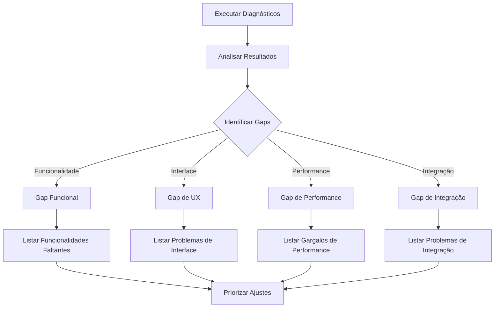

# 🔍 **DIAGNÓSTICO PARA DEFINIR AJUSTES FINOS NECESSÁRIOS**

## 🎯 **METODOLOGIA DE DIAGNÓSTICO**

Para definir precisamente quais ajustes finos são necessários, precisamos executar uma **análise diagnóstica sistemática** do sistema real em funcionamento.## 🎯 **ROTEIRO PARA DEFINIR AJUSTES FINOS**

### **📋 FASE 1: EXECUTAR DIAGNÓSTICO SISTEMÁTICO**

#### **1️⃣ Validação Técnica Completa**
```csharp
// Executar serviços de diagnóstico já implementados:

✅ Phase1ValidationService.ExecuteValidationSuiteAsync()
   - Testa carregamento de dados
   - Valida correção do bug das dezenas 1-9
   - Verifica implementação de interfaces
   - Testa MetronomoModel refatorado
   - Valida PredictionEngine
   - Mede performance geral

✅ Phase1CompletionValidator.ExecuteCompleteValidationAsync()
   - Validação completa de todos componentes
   - Testa integração entre componentes
   - Verifica preparação para Fase 2
   - Gera relatório executivo detalhado

✅ DiagnosticService.ExecuteSystemDiagnostic()
   - Detecta problemas específicos
   - Analisa distribuição de dezenas
   - Identifica gargalos de performance
```

#### **2️⃣ Teste de Interface e Experiência**
```csharp
// Usar ViewModels de validação implementados:

✅ ValidationViewModel.ExecuteValidationSuiteCommand()
   - Testa interface de validação
   - Verifica binding entre UI e backend
   - Valida exibição de resultados

✅ PredictionModelsViewModel.LoadAvailableModelsAsync()
   - Verifica carregamento de modelos na UI
   - Testa seleção de modelo ativo
   - Valida geração de predições

✅ ComparisonViewModel.CompareModelsCommand()
   - Testa comparação entre modelos
   - Verifica cálculo de métricas
   - Valida exibição de relatórios
```

#### **3️⃣ Validação de Modelos Específicos**
```csharp
// Usar serviços especializados disponíveis:

✅ AntiFrequencyValidation.ValidateAntiFrequencySystem()
   - Testa todos os modelos anti-frequencistas
   - Verifica correlação entre modelos
   - Valida performance individual

✅ MetaLearningValidationService.ExecuteCompleteValidationAsync()
   - Testa sistema de meta-learning
   - Verifica detecção de regimes
   - Valida ensemble inteligente

✅ ValidationMetricsService.ValidateAllStrategies()
   - Testa métricas de performance
   - Compara com baselines
   - Valida precisão dos cálculos
```

---

### **📊 FASE 2: ANÁLISE DE GAPS**

#### **🔍 Identificar Discrepâncias**


#### **📋 Categorizar Problemas**
```
🔴 CRÍTICOS (Bloqueia funcionalidade core)
🟡 IMPORTANTES (Afeta experiência do usuário)
🟢 MENORES (Melhorias cosméticas)
```

---

### **🎯 FASE 3: PLANO DE AÇÃO ESPECÍFICO**

#### **📝 Template de Diagnóstico**
```csharp
// Estrutura para capturar problemas:

public class DiagnosticResult
{
    public string Component { get; set; }
    public string Issue { get; set; }
    public Priority Priority { get; set; }
    public string ExpectedBehavior { get; set; }
    public string ActualBehavior { get; set; }
    public string SuggestedFix { get; set; }
    public TimeSpan EstimatedTime { get; set; }
}
```

#### **🔧 Categorias de Ajustes**
```
📊 DADOS E PERFORMANCE
   - Tempo de carregamento
   - Uso de memória
   - Precisão dos cálculos

🖥️ INTERFACE DE USUÁRIO
   - Exibição de modelos
   - Sincronização UI/backend
   - Feedback visual

⚙️ CONFIGURAÇÃO E SETUP
   - Parâmetros iniciais
   - Configurações padrão
   - Validação de entrada

🔗 INTEGRAÇÃO E FLUXO
   - Comunicação entre componentes
   - Tratamento de erros
   - Estados da aplicação
```

---

### **⚡ EXECUÇÃO IMEDIATA RECOMENDADA**

#### **🚀 Passos Práticos**
1. **Compilar e executar** o projeto
2. **Executar** `Phase1ValidationService.ExecuteValidationSuiteAsync()`
3. **Analisar** relatório gerado
4. **Executar** `Phase1CompletionValidator.ExecuteCompleteValidationAsync()`
5. **Testar** interface manualmente
6. **Documentar** todos os problemas encontrados

#### **📋 Checklist de Validação**
```
□ Sistema compila sem erros
□ Dados históricos carregam corretamente
□ Modelos aparecem na interface
□ Predições são geradas
□ Métricas são calculadas
□ Interface responde adequadamente
□ Performance está dentro do esperado
□ Relatórios são gerados corretamente
```

---

### **🎊 RESULTADO ESPERADO**

#### **📊 Relatório Final**
```
🎯 PROBLEMAS IDENTIFICADOS:
   - Lista detalhada de cada problema
   - Prioridade de cada item
   - Tempo estimado para correção
   - Solução sugerida

📈 MÉTRICAS ATUAIS:
   - Performance real vs esperada
   - Funcionalidades funcionando vs total
   - Qualidade da experiência do usuário

🔧 PLANO DE CORREÇÃO:
   - Ordem de implementação
   - Dependências entre correções
   - Timeline realista
```

#### **🎯 Próximos Passos Claros**
Após executar este diagnóstico, teremos:
- ✅ Lista precisa de ajustes necessários
- ✅ Priorização baseada em impacto
- ✅ Estimativas de tempo realistas
- ✅ Plano de implementação sequencial

**A chave é usar as ferramentas de diagnóstico já implementadas no sistema para obter dados precisos sobre o que realmente precisa ser ajustado! 🚀**