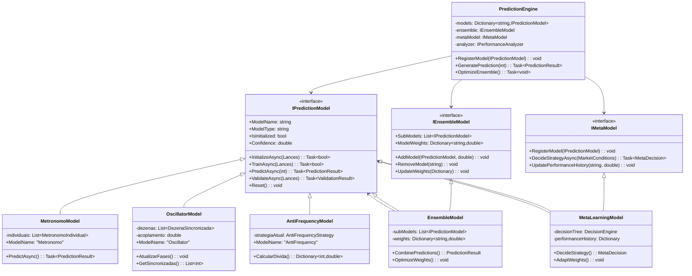
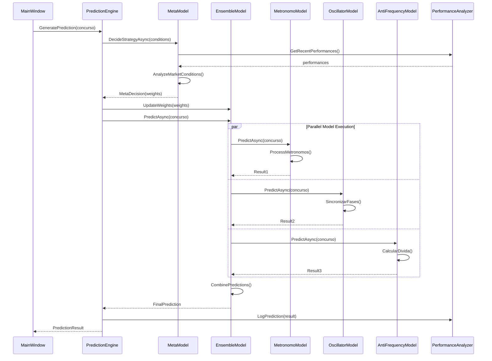
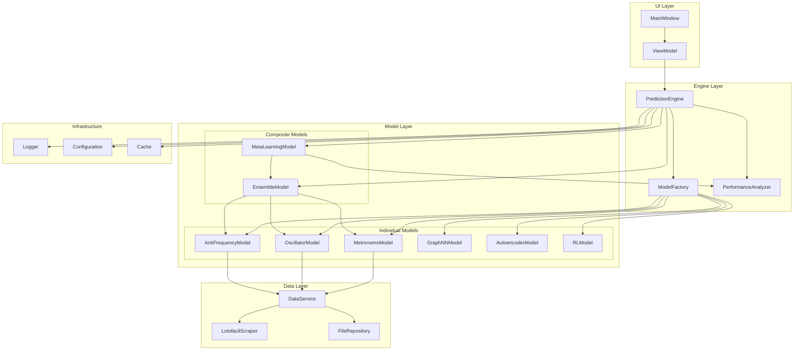
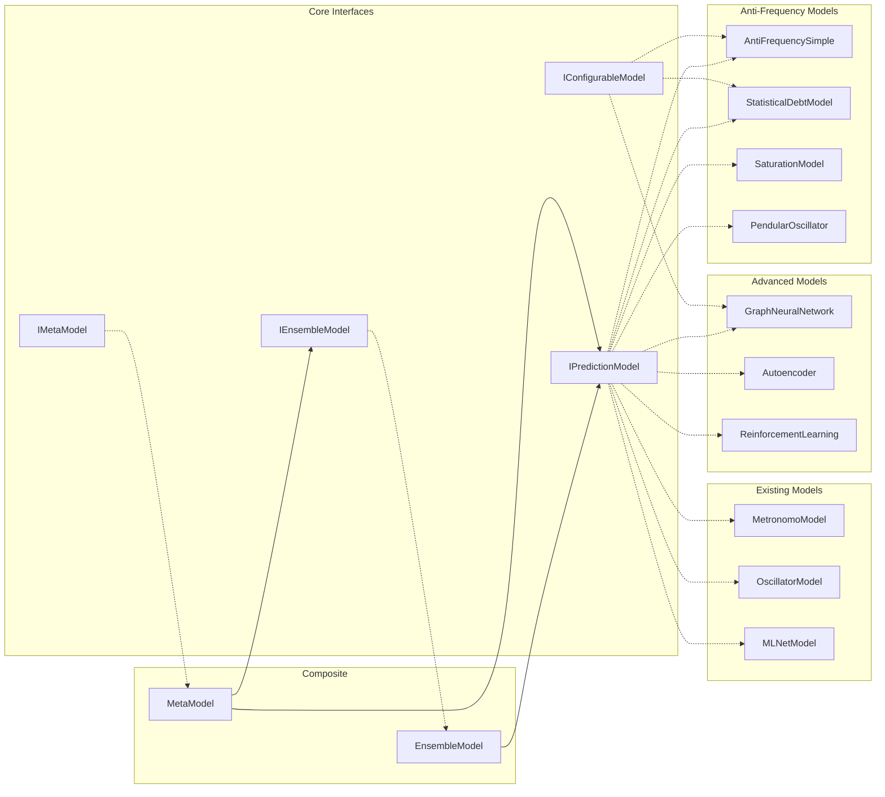
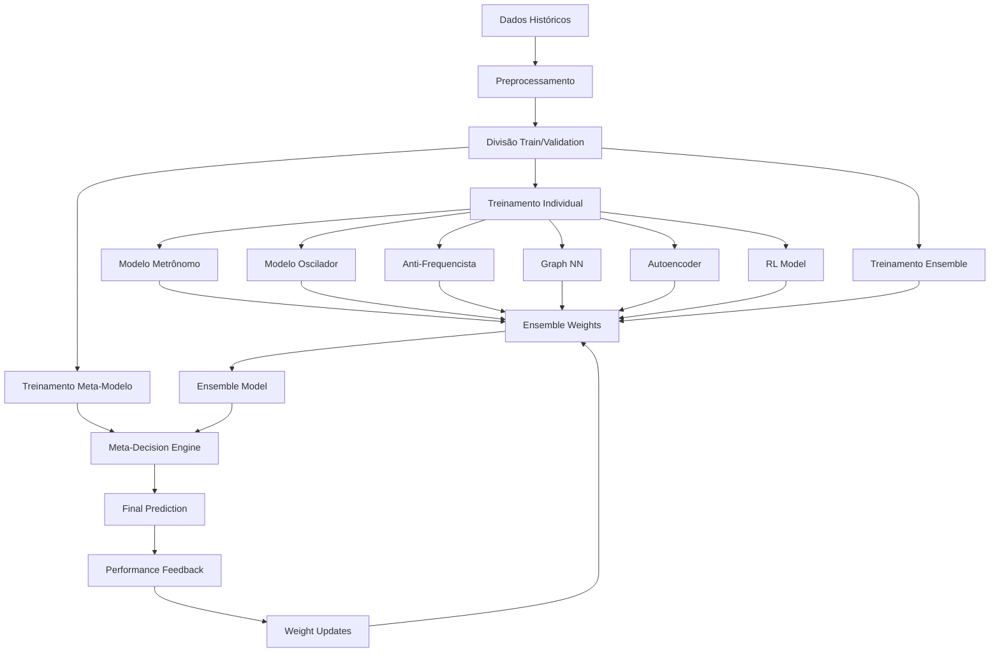

# 📊 DIAGRAMAS DE ARQUITETURA - SISTEMA LOTOFÁCIL

## 🏗️ **DIAGRAMA DE CLASSES PRINCIPAL**

## 🔄 **DIAGRAMA DE SEQUÊNCIA - GERAÇÃO DE PALPITE**

## 🏭 **DIAGRAMA DE COMPONENTES**

## 📊 **DIAGRAMA DE DEPENDÊNCIAS**

## 🔄 **FLUXO DE DADOS TEMPORAL**

