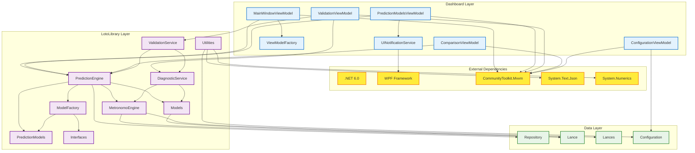
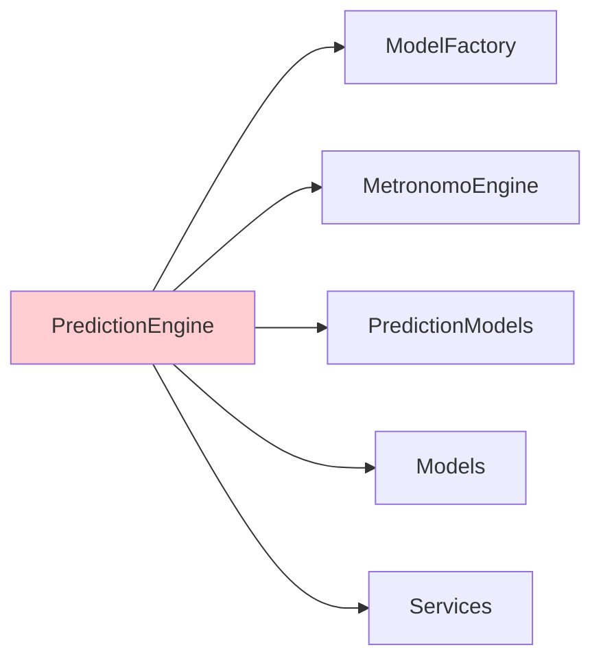
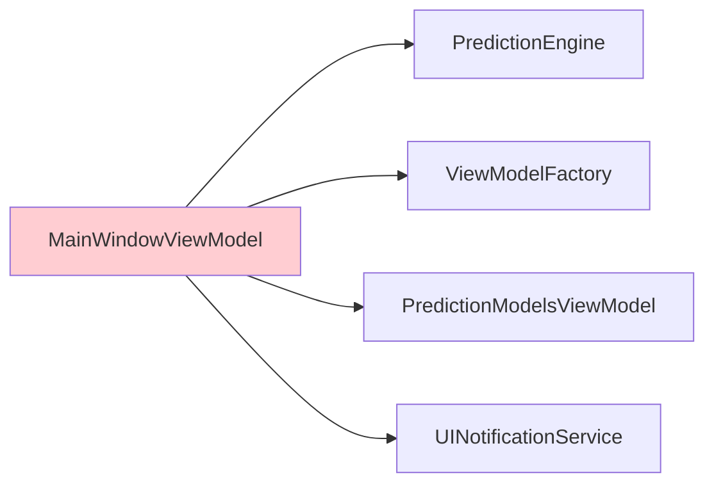
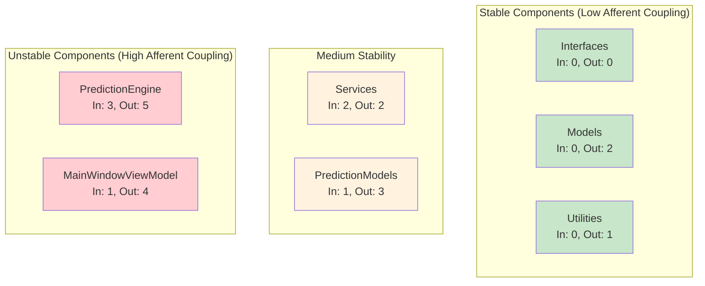
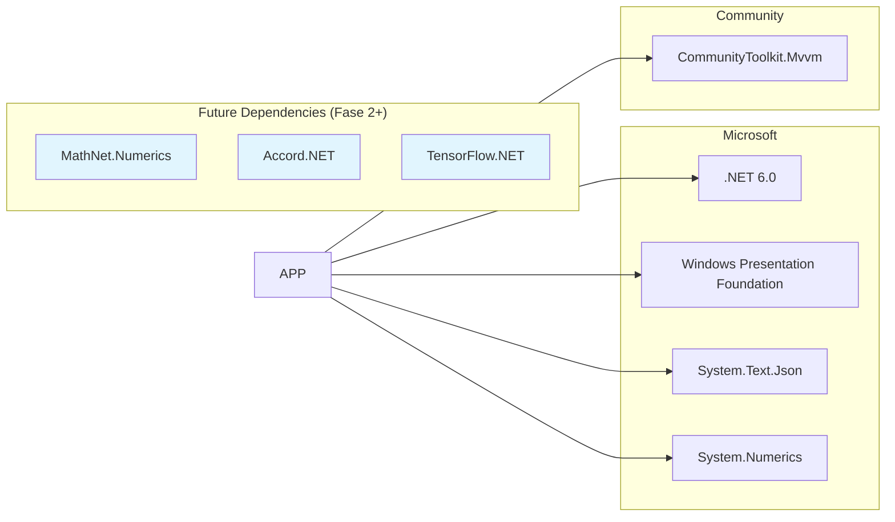

# 🔗 **DEPENDENCY ANALYSIS - ANÁLISE DE DEPENDÊNCIAS**

## 🎯 **VISÃO GERAL**

Esta análise mapeia todas as dependências do sistema, identificando padrões, pontos de acoplamento e oportunidades de otimização arquitetural.

---

## 📊 **MAPA GERAL DE DEPENDÊNCIAS**



---

## 📋 **MATRIZ DE DEPENDÊNCIAS DETALHADA**

### **Dependências por Componente:**

| Componente | Dependências Diretas | Nível | Acoplamento |
|------------|---------------------|-------|-------------|
| **MainWindowViewModel** | PredictionEngine, ViewModelFactory, MVVM | 4 | Alto |
| **PredictionModelsViewModel** | PredictionEngine, UINotificationService | 3 | Médio |
| **ValidationViewModel** | ValidationService, DiagnosticService | 3 | Médio |
| **ComparisonViewModel** | PredictionEngine, PerformanceAnalyzer | 3 | Médio |
| **ConfigurationViewModel** | Configuration, UINotificationService | 2 | Baixo |
| **PredictionEngine** | ModelFactory, Models, Services | 5 | Alto |
| **DiagnosticService** | MetronomoEngine, Models | 2 | Baixo |
| **ValidationService** | PredictionEngine, DiagnosticService | 2 | Baixo |
| **MetronomoEngine** | Lance, Lances, Utilities | 3 | Médio |
| **Models** | Utilities, Constants | 2 | Baixo |

---

## 🔍 **ANÁLISE DE ACOPLAMENTO**

### **Componentes com Alto Acoplamento (⚠️ Atenção)**

#### **1. PredictionEngine (5 dependências)**


**Justificativa**: Como coordenador central, este acoplamento é aceitável
**Mitigação**: Usar interfaces para reduzir dependências concretas

#### **2. MainWindowViewModel (4 dependências)**


**Problema**: Coordena muitas responsabilidades
**Solução**: ✅ **Já implementada** - Delegação para ViewModels especializados

---

## 🔄 **DEPENDÊNCIAS CIRCULARES**

### **Análise de Ciclos:**

✅ **Nenhuma dependência circular detectada!**

**Hierarquia limpa:**
```
Interfaces (Level 0)
    ↓
Models + Utilities + Constants (Level 1)
    ↓
Services (Level 2)
    ↓
PredictionModels (Level 3)
    ↓
Engines (Level 4)
    ↓
ViewModels (Level 5)
```

---

## 📈 **MÉTRICAS DE QUALIDADE ARQUITETURAL**

### **Estabilidade dos Componentes**



### **Fórmulas de Estabilidade:**
- **Instabilidade = Ce / (Ca + Ce)**
  - Ce = Efferent Coupling (dependências de saída)
  - Ca = Afferent Coupling (dependências de entrada)
- **Range**: 0 (estável) a 1 (instável)

| Componente | Ca | Ce | Instabilidade | Classificação |
|------------|----|----|---------------|---------------|
| Interfaces | 0 | 0 | 0.00 | ✅ Muito Estável |
| Models | 0 | 2 | 1.00 | ⚠️ Instável |
| Utilities | 0 | 1 | 1.00 | ⚠️ Instável |
| Services | 2 | 2 | 0.50 | 🔄 Balanceado |
| PredictionModels | 1 | 3 | 0.75 | ⚠️ Instável |
| Engines | 3 | 5 | 0.63 | 🔄 Levemente Instável |
| ViewModels | 1 | 4 | 0.80 | ⚠️ Instável |

---

## 🎯 **DEPENDÊNCIAS EXTERNAS**

### **Bibliotecas Utilizadas:**



### **Análise de Risco por Dependência:**

| Biblioteca | Versão | Licença | Risco | Alternativas |
|------------|--------|---------|-------|-------------|
| **.NET 6.0** | 6.0.x | MIT | ✅ Baixo | N/A (Base) |
| **WPF** | Built-in | MIT | ✅ Baixo | Avalonia, MAUI |
| **CommunityToolkit.Mvvm** | 8.x | MIT | ✅ Baixo | ReactiveUI, Prism |
| **System.Text.Json** | Built-in | MIT | ✅ Baixo | Newtonsoft.Json |
| **System.Numerics** | Built-in | MIT | ✅ Baixo | Math.NET |

---

## 🔧 **INJEÇÃO DE DEPENDÊNCIA**

### **Padrão Atual: Factory Pattern**

```csharp
public class ViewModelFactory
{
    private readonly Lances _historicalData;
    private readonly PredictionEngine _predictionEngine;
    
    public ViewModelFactory(Lances historicalData)
    {
        _historicalData = historicalData;
        _predictionEngine = new PredictionEngine();
    }
    
    public PredictionModelsViewModel CreatePredictionModelsViewModel()
    {
        return new PredictionModelsViewModel(_predictionEngine, new UINotificationService());
    }
}
```

### **Proposta: Dependency Injection Container (Fase 3)**

```csharp
// Configuração do DI Container
services.AddSingleton<IPredictionEngine, PredictionEngine>();
services.AddSingleton<IModelFactory, ModelFactory>();
services.AddScoped<IValidationService, ValidationService>();
services.AddScoped<IDiagnosticService, DiagnosticService>();

// ViewModels
services.AddTransient<PredictionModelsViewModel>();
services.AddTransient<ValidationViewModel>();
services.AddTransient<ComparisonViewModel>();
```

**Benefícios:**
- ✅ Testabilidade melhorada
- ✅ Acoplamento reduzido
- ✅ Configuração centralizada
- ✅ Lifetime management automático

---

## 📊 **IMPACTO DE MUDANÇAS**

### **Análise de Propagação:**

```mermaid
graph TB
    subgraph "High Impact Changes"
        INTERFACE_CHANGE[Mudança em Interface]
        MODEL_CHANGE[Mudança em Models]
    end
    
    subgraph "Medium Impact Changes"
        ENGINE_CHANGE[Mudança em Engine]
        SERVICE_CHANGE[Mudança em Service]
    end
    
    subgraph "Low Impact Changes"
        VM_CHANGE[Mudança em ViewModel]
        UTIL_CHANGE[Mudança em Utility]
    end
    
    INTERFACE_CHANGE --> |Afeta| PM[PredictionModels]
    INTERFACE_CHANGE --> |Afeta| PE[PredictionEngine]
    INTERFACE_CHANGE --> |Afeta| MF[ModelFactory]
    
    MODEL_CHANGE --> |Afeta| PE[PredictionEngine]
    MODEL_CHANGE --> |Afeta| SRV[Services]
    MODEL_CHANGE --> |Afeta| PM[PredictionModels]
    
    ENGINE_CHANGE --> |Afeta| MVM[MainWindowViewModel]
    ENGINE_CHANGE --> |Afeta| PVM[PredictionModelsViewModel]
    
    SERVICE_CHANGE --> |Afeta| VVM[ValidationViewModel]
    
    VM_CHANGE --> |Afeta| UI[UI Only]
    UTIL_CHANGE --> |Afeta| CALLER[Specific Callers]
    
    style INTERFACE_CHANGE fill:#ffcdd2
    style MODEL_CHANGE fill:#ffcdd2
    style ENGINE_CHANGE fill:#fff3e0
    style SERVICE_CHANGE fill:#fff3e0
    style VM_CHANGE fill:#c8e6c9
    style UTIL_CHANGE fill:#c8e6c9
```



### **Estratégias de Mitigação:**

1. **Para mudanças em Interfaces:**
   - Usar versionamento de interfaces
   - Implementar adaptadores temporários
   - Deprecation warnings

2. **Para mudanças em Models:**
   - Migration scripts
   - Backward compatibility
   - Data transformation layers

3. **Para mudanças em Engines:**
   - Feature flags
   - A/B testing
   - Rollback capabilities

---

## 🎯 **RECOMENDAÇÕES DE OTIMIZAÇÃO**

### **Curto Prazo (Fase 2):**

1. **Reduzir acoplamento em PredictionEngine:**
   ```csharp
   // Ao invés de dependência direta
   private readonly MetronomoEngine _metronomoEngine;
   
   // Usar factory ou registry
   private readonly IModelRegistry _modelRegistry;
   ```

2. **Implementar interfaces para Services:**
   ```csharp
   public interface IDiagnosticService
   {
       Task<DiagnosticReport> TestSystemAsync();
   }
   ```

### **Médio Prazo (Fase 3):**

1. **Implementar DI Container**
2. **Criar abstrações para dependências externas**
3. **Implementar Event Bus para comunicação desacoplada**

### **Longo Prazo (Fase 4+):**

1. **Microservices architecture** (se necessário)
2. **Plugin system** para modelos
3. **Configuration-driven dependencies**

---

## 📈 **MÉTRICAS DE MONITORAMENTO**

### **KPIs de Qualidade Arquitetural:**

- **Acoplamento Médio**: < 4 dependências por componente
- **Profundidade de Herança**: < 3 níveis
- **Dependências Circulares**: 0 (zero)
- **Cobertura de Interfaces**: > 80%
- **Estabilidade Média**: 0.3 - 0.7 (balanceado)

### **Alerts de Qualidade:**

- 🚨 **Crítico**: Componente com > 6 dependências
- ⚠️ **Warning**: Componente com instabilidade > 0.8
- ℹ️ **Info**: Nova dependência externa adicionada

Esta análise garante que o sistema mantenha alta qualidade arquitetural conforme evolui, identificando proativamente pontos de melhoria e riscos potenciais.