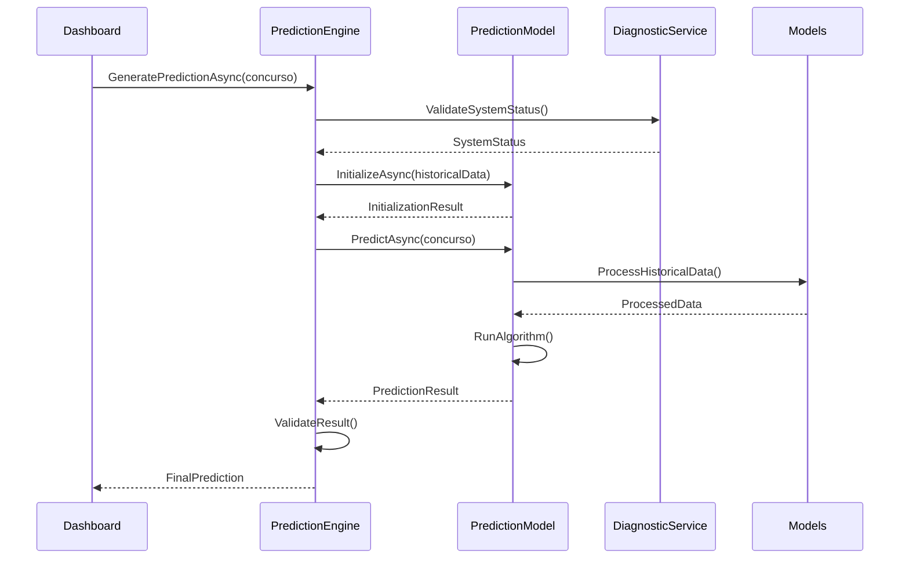
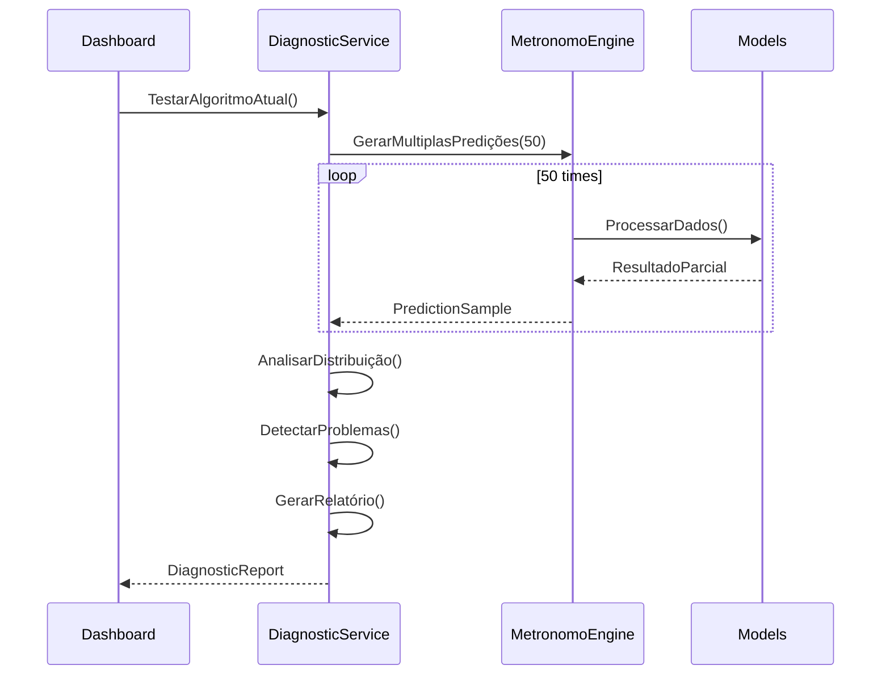
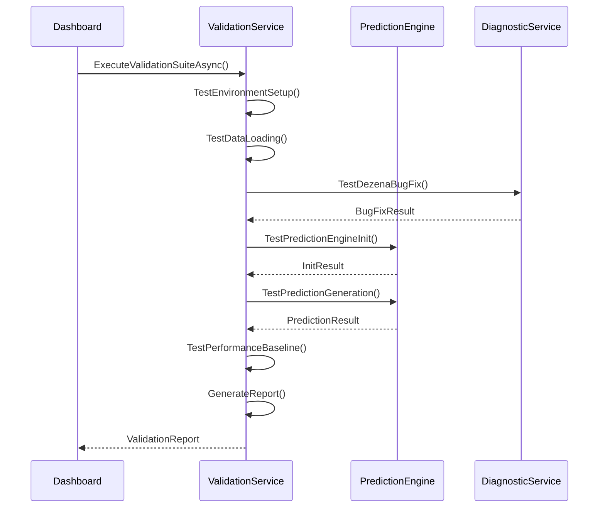

# 📚 **LotoLibrary - DOCUMENTAÇÃO CORE**

## 🎯 **VISÃO GERAL**

A **LotoLibrary** é o núcleo da aplicação, contendo toda a lógica de negócios independente de UI. Implementa os algoritmos de predição, gerenciamento de dados e serviços especializados.

---

## 📁 **ESTRUTURA DETALHADA**

### **📁 Interfaces/** 
**Responsabilidade**: Contratos e abstrações do sistema
```
Interfaces/
├── IPredictionModel.cs      ← Interface base para modelos
├── IEnsembleModel.cs        ← Interface para modelos ensemble
├── IMetaModel.cs            ← Interface para meta-modelos
├── IModelFactory.cs         ← Factory de criação de modelos
├── IPerformanceAnalyzer.cs  ← Análise de performance
└── IConfigurableModel.cs    ← Modelos configuráveis
```

**Dependências**: Nenhuma (ponto de entrada)
**Complexidade**: ⭐ Baixa

### **📁 Models/**
**Responsabilidade**: Estruturas de dados e entidades
```
Models/
├── Core/
│   ├── Lance.cs             ← Entidade principal de sorteio
│   ├── Lances.cs            ← Coleção de sorteios
│   └── Lotofacil.cs         ← Configurações do jogo
├── Prediction/
│   ├── PredictionResult.cs  ← Resultado de predição
│   ├── ValidationResult.cs  ← Resultado de validação
│   └── ModelExplanation.cs  ← Explicação do modelo
└── Configuration/
    ├── ModelParameters.cs   ← Parâmetros de modelos
    └── EnsembleConfig.cs    ← Configuração de ensemble
```

**Dependências**: Utilities
**Complexidade**: ⭐⭐ Baixa-Média

### **📁 Engines/**
**Responsabilidade**: Coordenação e orquestração dos modelos
```
Engines/
├── PredictionEngine.cs      ← Coordenador principal (NOVO)
├── MetronomoEngine.cs       ← Engine de metrônomos (LEGADO)
└── ModelFactory.cs          ← Factory de modelos
```

**Dependências**: Models, Services, PredictionModels, Interfaces
**Complexidade**: ⭐⭐⭐⭐ Alta

### **📁 Services/**
**Responsabilidade**: Serviços especializados
```
Services/
├── DiagnosticService.cs     ← Diagnóstico de bugs
├── Phase1ValidationService.cs ← Validação da Fase 1
├── Analysis/
│   ├── PerformanceAnalyzer.cs ← Análise de performance
│   └── StatisticalAnalyzer.cs ← Análise estatística
└── Data/
    ├── DataPreprocessor.cs  ← Pré-processamento
    └── FeatureExtractor.cs  ← Extração de features
```

**Dependências**: Models, Interfaces
**Complexidade**: ⭐⭐⭐ Média-Alta

### **📁 PredictionModels/**
**Responsabilidade**: Implementação dos algoritmos de predição
```
PredictionModels/
├── Base/
│   └── PredictionModelBase.cs ← Classe base
├── Individual/
│   ├── MetronomoModel.cs    ← Modelo refatorado
│   └── OscillatorModel.cs   ← Modelo de osciladores
├── AntiFrequency/           ← 🚀 FASE 2
│   ├── AntiFrequencySimpleModel.cs
│   ├── StatisticalDebtModel.cs
│   ├── SaturationModel.cs
│   └── PendularOscillatorModel.cs
├── Advanced/                ← 🚀 FASE 4
│   ├── GraphNeuralNetworkModel.cs
│   ├── AutoencoderModel.cs
│   └── ReinforcementLearningModel.cs
└── Composite/               ← 🚀 FASE 3
    ├── EnsembleModel.cs
    └── MetaLearningModel.cs
```

**Dependências**: Models, Interfaces, Base classes
**Complexidade**: ⭐⭐⭐⭐⭐ Muito Alta

### **📁 Utilities/**
**Responsabilidade**: Utilitários e helpers
```
Utilities/
├── Infra.cs                 ← Infraestrutura geral
├── SystemInfo.cs            ← Informações do sistema
├── ValidationHelpers.cs     ← Helpers de validação
└── MathExtensions.cs        ← Extensões matemáticas
```

**Dependências**: System libraries
**Complexidade**: ⭐⭐ Baixa-Média

### **📁 Constants/**
**Responsabilidade**: Constantes do sistema
```
Constants/
├── Phase1Constants.cs       ← Constantes da Fase 1
├── ModelTypes.cs            ← Tipos de modelos
└── PredictionConstants.cs   ← Constantes de predição
```

**Dependências**: Nenhuma
**Complexidade**: ⭐ Baixa

---

## 🔄 **DIAGRAMAS DE SEQUÊNCIA**

### **1. Fluxo de Predição Principal**



### **2. Fluxo de Diagnóstico**



### **3. Fluxo de Validação da Fase 1**



---

## 🔗 **ANÁLISE DE DEPENDÊNCIAS**

### **Matriz de Dependências**

|              | Interfaces | Models | Engines | Services | PredictionModels | Utilities | Constants |
|--------------|------------|--------|---------|----------|------------------|-----------|-----------|
| **Interfaces** | -          | ❌     | ❌      | ❌       | ❌               | ❌        | ❌        |
| **Models**     | ❌         | -      | ❌      | ❌       | ❌               | ✅        | ✅        |
| **Engines**    | ✅         | ✅     | -       | ✅       | ✅               | ✅        | ✅        |
| **Services**   | ✅         | ✅     | ❌      | -        | ❌               | ✅        | ✅        |
| **PredictionModels** | ✅   | ✅     | ❌      | ❌       | -                | ✅        | ✅        |
| **Utilities**  | ❌         | ❌     | ❌      | ❌       | ❌               | -         | ❌        |
| **Constants**  | ❌         | ❌     | ❌      | ❌       | ❌               | ❌        | -         |

### **Hierarquia de Dependência**
```
Interfaces (Nível 0) ← Base do sistema
    ↓
Models + Utilities + Constants (Nível 1) ← Estruturas fundamentais
    ↓
Services (Nível 2) ← Funcionalidades especializadas
    ↓
PredictionModels (Nível 3) ← Algoritmos de predição
    ↓
Engines (Nível 4) ← Coordenação e orquestração
```

---

## 📊 **MÉTRICAS DE QUALIDADE**

### **Acoplamento**
- **Interfaces**: 0 dependências → ✅ Excelente
- **Models**: 2 dependências → ✅ Bom
- **Services**: 4 dependências → ⚠️ Aceitável
- **PredictionModels**: 4 dependências → ⚠️ Aceitável
- **Engines**: 6 dependências → ❌ Alto (justificado como coordenador)

### **Coesão**
- **Interfaces**: Alta → ✅ Contratos bem definidos
- **Models**: Alta → ✅ Entidades relacionadas
- **Services**: Média → ⚠️ Serviços diversos
- **PredictionModels**: Alta → ✅ Algoritmos especializados
- **Engines**: Média → ⚠️ Múltiplas responsabilidades

### **Testabilidade**
- **Interfaces**: N/A → Contratos
- **Models**: ✅ Alta → Estruturas simples
- **Services**: ✅ Alta → Lógica isolada
- **PredictionModels**: ✅ Alta → Algoritmos testáveis
- **Engines**: ⚠️ Média → Múltiplas dependências

---

## 🎯 **PADRÕES DE USO**

### **Para Adicionar Novo Modelo de Predição:**
```csharp
// 1. Implementar interface
public class NovoModel : PredictionModelBase, IPredictionModel
{
    public async Task<PredictionResult> PredictAsync(int concurso)
    {
        // Implementar algoritmo
    }
}

// 2. Registrar no Factory
modelFactory.RegisterModel<NovoModel>("NovoModel");

// 3. Usar via Engine
var result = await predictionEngine.GeneratePredictionAsync(concurso);
```

### **Para Adicionar Novo Serviço:**
```csharp
// 1. Definir interface
public interface INovoService
{
    Task<ResultType> ProcessAsync(InputType input);
}

// 2. Implementar serviço
public class NovoService : INovoService
{
    // Implementação
}

// 3. Registrar no DI container
```

---

## 🚀 **ROADMAP DE EVOLUÇÃO**

### **Fase 2: Anti-Frequencistas**
- Implementar 4 novos modelos em `PredictionModels/AntiFrequency/`
- Adicionar serviços de análise estatística
- Expandir utilitários matemáticos

### **Fase 3: Ensemble**
- Implementar `EnsembleModel` em `PredictionModels/Composite/`
- Adicionar otimização de pesos
- Expandir métricas de performance

### **Fase 4: IA Avançada**
- Implementar modelos em `PredictionModels/Advanced/`
- Adicionar serviços de ML
- Integrar bibliotecas externas

Esta estrutura modular garante que cada nova fase seja implementada com mínimo impacto nas existentes, mantendo alta qualidade e testabilidade.