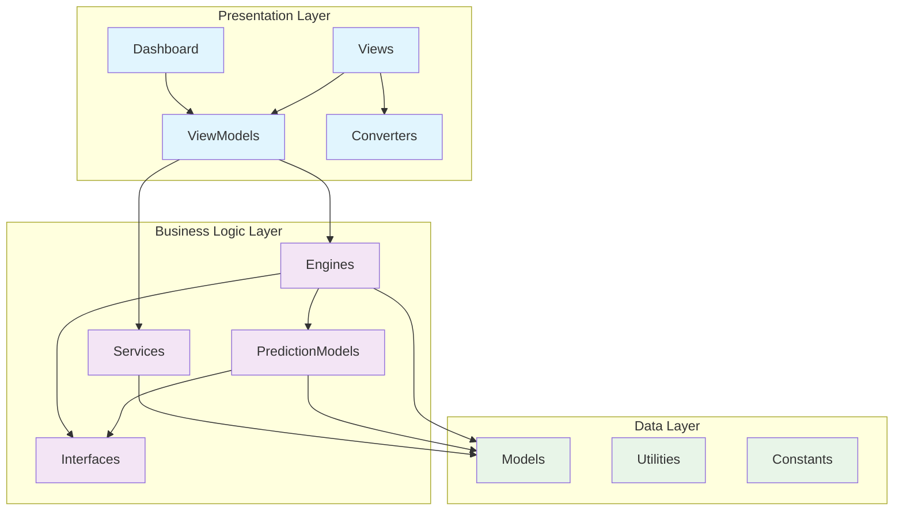

# 📁 **DOCUMENTAÇÃO COMPLETA DAS PASTAS DO PROJETO**

## 🏗️ **ESTRUTURA GERAL DO PROJETO**

```
LotoFacil/
├── 📁 LotoLibrary/          ← Core da aplicação (Business Logic)
│   ├── 📁 Interfaces/       ← Contratos e abstrações
│   ├── 📁 Models/           ← Modelos de dados e entidades
│   ├── 📁 Engines/          ← Motores de processamento
│   ├── 📁 Services/         ← Serviços especializados
│   ├── 📁 PredictionModels/ ← Modelos de predição
│   ├── 📁 Utilities/        ← Utilitários e helpers
│   └── 📁 Constants/        ← Constantes do sistema
│
├── 📁 Dashboard/            ← Interface de usuário (Presentation)
│   ├── 📁 ViewModels/       ← ViewModels MVVM
│   ├── 📁 Views/            ← Interfaces XAML
│   ├── 📁 Converters/       ← Conversores de dados
│   ├── 📁 Services/         ← Serviços de UI
│   ├── 📁 Migration/        ← Scripts de migração
│   ├── 📁 Utilities/        ← Utilitários de UI
│   └── 📁 Exemplos/         ← Exemplos de uso
│
└── 📁 Docs/                 ← Documentação
    ├── 📁 New/              ← Documentação da nova arquitetura
    └── 📁 Legacy/           ← Documentação legada
```

---

## 🎯 **PRINCÍPIOS ARQUITETURAIS**

### **Separação de Responsabilidades**
- **LotoLibrary**: Lógica de negócios independente de UI
- **Dashboard**: Interface de usuário e apresentação
- **Docs**: Documentação e especificações

### **Padrões Implementados**
- **MVVM**: Model-View-ViewModel para UI
- **Strategy Pattern**: Diferentes algoritmos de predição
- **Factory Pattern**: Criação de modelos
- **Repository Pattern**: Acesso a dados
- **Observer Pattern**: Notificações e eventos

### **Dependências**
```
Dashboard ──depends on──> LotoLibrary
LotoLibrary ──independent──> Standalone
```

---

## 📊 **DIAGRAMA DE DEPENDÊNCIAS GERAL**



---

## 🔍 **ANÁLISE DE COMPLEXIDADE POR PASTA**

| Pasta | Complexidade | Responsabilidades | Interdependências |
|-------|--------------|-------------------|-------------------|
| **Interfaces** | Baixa | Contratos, abstrações | Nenhuma |
| **Models** | Baixa | Entidades, DTOs | Utilities |
| **Engines** | Alta | Coordenação, orquestração | Models, Services, PredictionModels |
| **Services** | Média | Funcionalidades específicas | Models, Interfaces |
| **PredictionModels** | Alta | Algoritmos de predição | Models, Interfaces |
| **ViewModels** | Média | Binding, comandos UI | Engines, Services |
| **Views** | Baixa | Interface visual | ViewModels, Converters |

---

## 🚀 **FLUXO DE DESENVOLVIMENTO**

### **Ordem Recomendada para Implementação:**
1. **Interfaces** → Define contratos
2. **Models** → Estruturas de dados
3. **Services** → Funcionalidades básicas
4. **PredictionModels** → Algoritmos individuais
5. **Engines** → Coordenação
6. **ViewModels** → Interface de apresentação
7. **Views** → Interface visual

### **Modificação de Arquivos:**
- **Modificação Frequente**: ViewModels, PredictionModels
- **Modificação Ocasional**: Services, Engines
- **Modificação Rara**: Interfaces, Models

---

## 📋 **ÍNDICE DE DOCUMENTAÇÃO DETALHADA**

1. [📁 LotoLibrary - Core Documentation](./LotoLibrary-Documentation.md)
2. [📁 Dashboard - UI Documentation](./Dashboard-Documentation.md)  
3. [🔄 Sequence Diagrams](./Sequence-Diagrams.md)
4. [🔗 Dependency Analysis](./Dependency-Analysis.md)
5. [🎯 Migration Guide](./Migration-Guide.md)

Cada pasta será documentada em detalhes nos arquivos específicos com diagramas de sequência e análise de dependências completa.