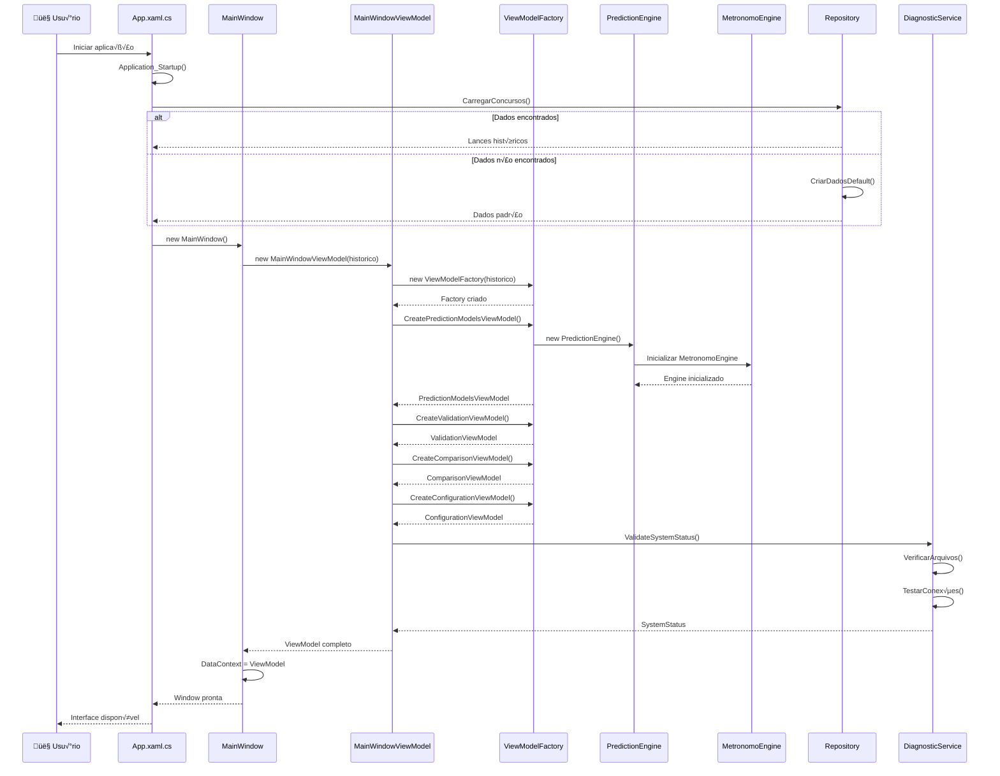
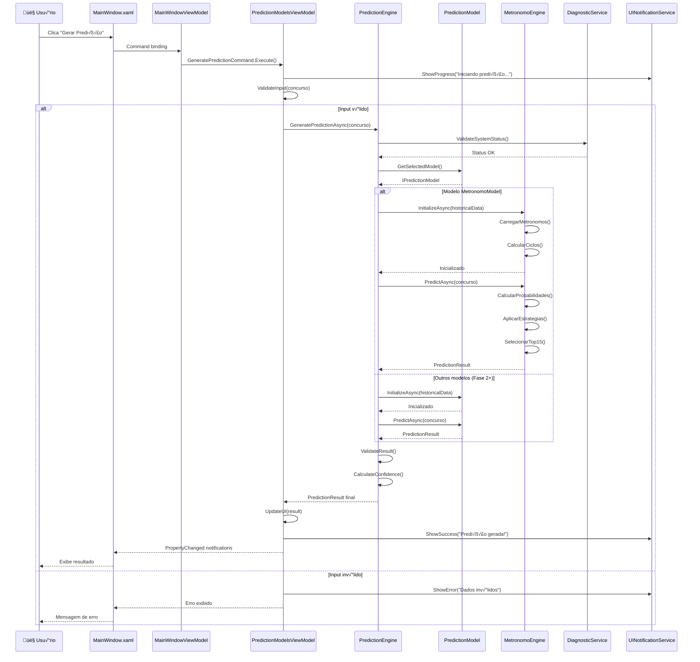
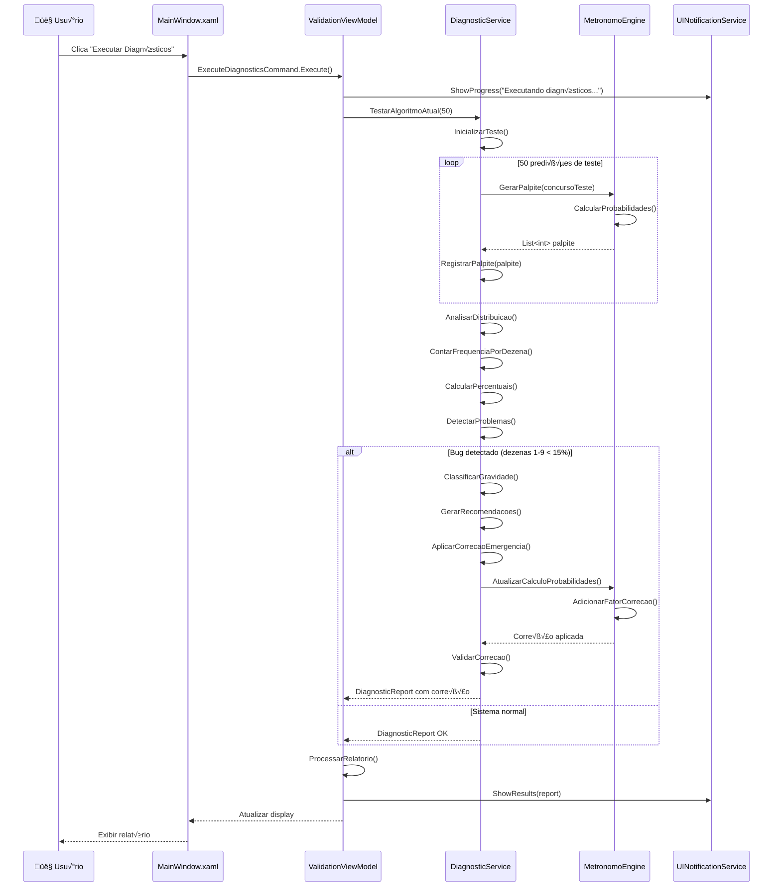
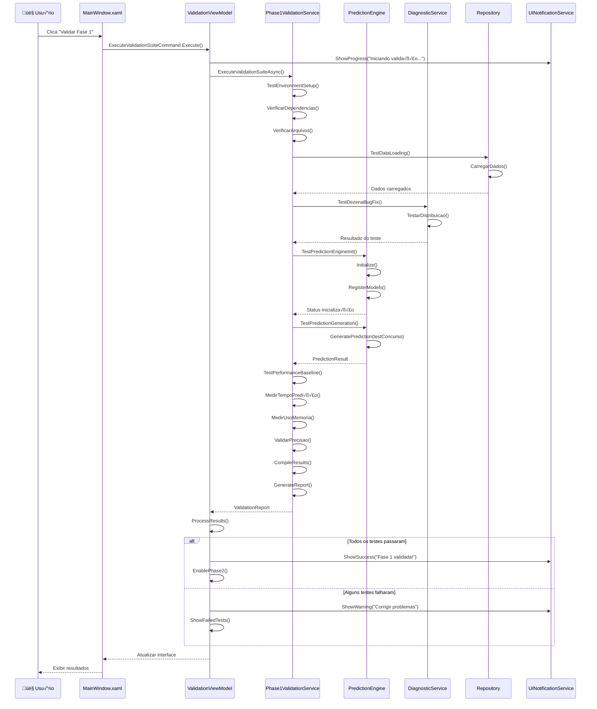
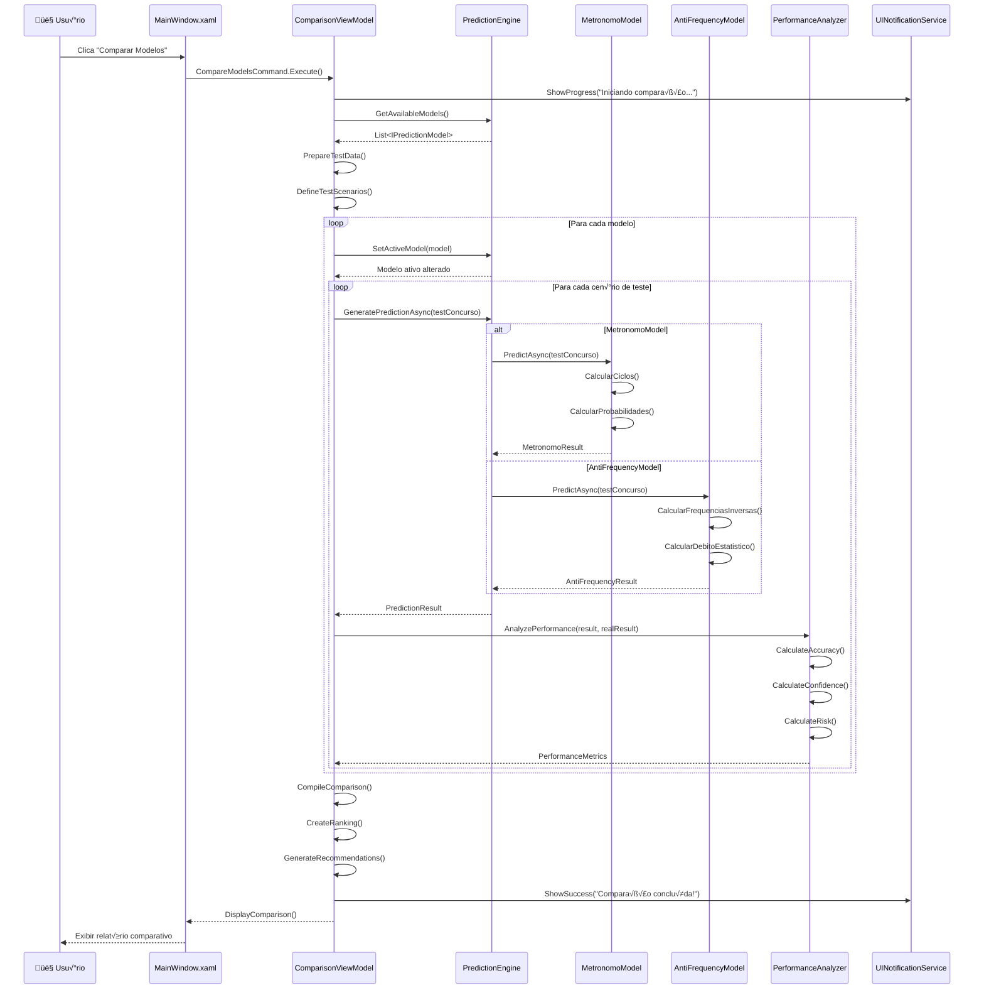

# 🔄 **SEQUENCE DIAGRAMS - FLUXOS PRINCIPAIS**

## 🎯 **VISÃO GERAL**

Este documento contém diagramas de sequência detalhados dos principais fluxos do sistema, mostrando como os componentes interagem entre si durante operações críticas.

---

## 🚀 **1. FLUXO COMPLETO DE INICIALIZAÇÃO DO SISTEMA**

```mermaid
sequenceDiagram
    participant User as 👤 Usuário
    participant App as App.xaml.cs
    participant MW as MainWindow
    participant MVM as MainWindowViewModel
    participant F as ViewModelFactory
    participant PE as PredictionEngine
    participant ME as MetronomoEngine
    participant Repo as Repository
    participant DS as DiagnosticService

    User->>App: Iniciar aplicação
    
    App->>App: Application_Startup()
    App->>Repo: CarregarConcursos()
    
    alt Dados encontrados
        Repo-->>App: Lances históricos
    else Dados n√£o encontrados
        Repo->>Repo: CriarDadosDefault()
        Repo-->>App: Dados padr√£o
    end
    
    App->>MW: new MainWindow()
    MW->>MVM: new MainWindowViewModel(historico)
    
    MVM->>F: new ViewModelFactory(historico)
    F-->>MVM: Factory criado
    
    MVM->>F: CreatePredictionModelsViewModel()
    F->>PE: new PredictionEngine()
    PE->>ME: Inicializar MetronomoEngine
    ME-->>PE: Engine inicializado
    F-->>MVM: PredictionModelsViewModel
    
    MVM->>F: CreateValidationViewModel()
    F-->>MVM: ValidationViewModel
    
    MVM->>F: CreateComparisonViewModel()
    F-->>MVM: ComparisonViewModel
    
    MVM->>F: CreateConfigurationViewModel()
    F-->>MVM: ConfigurationViewModel
    
    MVM->>DS: ValidateSystemStatus()
    DS->>DS: VerificarArquivos()
    DS->>DS: TestarConexões()
    DS-->>MVM: SystemStatus
    
    MVM-->>MW: ViewModel completo
    MW->>MW: DataContext = ViewModel
    MW-->>App: Window pronta
    App-->>User: Interface disponível
```

---

## 🎯 **2. FLUXO DE GERAÇÃO DE PREDIÇÃO**

```mermaid
sequenceDiagram
    participant User as 👤 Usuário
    participant UI as MainWindow.xaml
    participant MVM as MainWindowViewModel
    participant PVM as PredictionModelsViewModel
    participant PE as PredictionEngine
    participant PM as PredictionModel
    participant ME as MetronomoEngine
    participant DS as DiagnosticService
    participant UN as UINotificationService

    User->>UI: Clica "Gerar Predição"
    UI->>MVM: Command binding
    MVM->>PVM: GeneratePredictionCommand.Execute()
    
    PVM->>UN: ShowProgress("Iniciando predição...")
    PVM->>PVM: ValidateInput(concurso)
    
    alt Input v√°lido
        PVM->>PE: GeneratePredictionAsync(concurso)
        
        PE->>DS: ValidateSystemStatus()
        DS-->>PE: Status OK
        
        PE->>PM: GetSelectedModel()
        PM-->>PE: IPredictionModel
        
        alt Modelo MetronomoModel
            PE->>ME: InitializeAsync(historicalData)
            ME->>ME: CarregarMetronomos()
            ME->>ME: CalcularCiclos()
            ME-->>PE: Inicializado
            
            PE->>ME: PredictAsync(concurso)
            ME->>ME: CalcularProbabilidades()
            ME->>ME: AplicarEstrategias()
            ME->>ME: SelecionarTop15()
            ME-->>PE: PredictionResult
            
        else Outros modelos (Fase 2+)
            PE->>PM: InitializeAsync(historicalData)
            PM-->>PE: Inicializado
            PE->>PM: PredictAsync(concurso)
            PM-->>PE: PredictionResult
        end
        
        PE->>PE: ValidateResult()
        PE->>PE: CalculateConfidence()
        PE-->>PVM: PredictionResult final
        
        PVM->>PVM: UpdateUI(result)
        PVM->>UN: ShowSuccess("Predição gerada!")
        PVM-->>UI: PropertyChanged notifications
        UI-->>User: Exibe resultado
        
    else Input inv√°lido
        PVM->>UN: ShowError("Dados inv√°lidos")
        PVM-->>UI: Erro exibido
        UI-->>User: Mensagem de erro
    end
```

---

## 🔍 **3. FLUXO DE DIAGNÓSTICO E CORREÇÃO DE BUG**

```mermaid
sequenceDiagram
    participant User as 👤 Usuário
    participant UI as MainWindow.xaml
    participant VVM as ValidationViewModel
    participant DS as DiagnosticService
    participant ME as MetronomoEngine
    participant UN as UINotificationService

    User->>UI: Clica "Executar Diagnósticos"
    UI->>VVM: ExecuteDiagnosticsCommand.Execute()
    
    VVM->>UN: ShowProgress("Executando diagnósticos...")
    VVM->>DS: TestarAlgoritmoAtual(50)
    
    DS->>DS: InicializarTeste()
    
    loop 50 predições de teste
        DS->>ME: GerarPalpite(concursoTeste)
        ME->>ME: CalcularProbabilidades()
        ME-->>DS: List<int> palpite
        DS->>DS: RegistrarPalpite(palpite)
    end
    
    DS->>DS: AnalisarDistribuicao()
    DS->>DS: ContarFrequenciaPorDezena()
    DS->>DS: CalcularPercentuais()
    
    DS->>DS: DetectarProblemas()
    
    alt Bug detectado (dezenas 1-9 < 15%)
        DS->>DS: ClassificarGravidade()
        DS->>DS: GerarRecomendacoes()
        DS->>DS: AplicarCorrecaoEmergencia()
        
        DS->>ME: AtualizarCalculoProbabilidades()
        ME->>ME: AdicionarFatorCorrecao()
        ME-->>DS: Correção aplicada
        
        DS->>DS: ValidarCorrecao()
        DS-->>VVM: DiagnosticReport com correção
        
    else Sistema normal
        DS-->>VVM: DiagnosticReport OK
    end
    
    VVM->>VVM: ProcessarRelatorio()
    VVM->>UN: ShowResults(report)
    VVM-->>UI: Atualizar display
    UI-->>User: Exibir relatório
```

---

## ✅ **4. FLUXO DE VALIDAÇÃO COMPLETA DA FASE 1**

```mermaid
sequenceDiagram
    participant User as 👤 Usuário
    participant UI as MainWindow.xaml
    participant VVM as ValidationViewModel
    participant VS as Phase1ValidationService
    participant PE as PredictionEngine
    participant DS as DiagnosticService
    participant Repo as Repository
    participant UN as UINotificationService

    User->>UI: Clica "Validar Fase 1"
    UI->>VVM: ExecuteValidationSuiteCommand.Execute()
    
    VVM->>UN: ShowProgress("Iniciando validação...")
    VVM->>VS: ExecuteValidationSuiteAsync()
    
    VS->>VS: TestEnvironmentSetup()
    VS->>VS: VerificarDependencias()
    VS->>VS: VerificarArquivos()
    
    VS->>Repo: TestDataLoading()
    Repo->>Repo: CarregarDados()
    Repo-->>VS: Dados carregados
    
    VS->>DS: TestDezenaBugFix()
    DS->>DS: TestarDistribuicao()
    DS-->>VS: Resultado do teste
    
    VS->>PE: TestPredictionEngineInit()
    PE->>PE: Initialize()
    PE->>PE: RegisterModels()
    PE-->>VS: Status inicialização
    
    VS->>PE: TestPredictionGeneration()
    PE->>PE: GeneratePrediction(testConcurso)
    PE-->>VS: PredictionResult
    
    VS->>VS: TestPerformanceBaseline()
    VS->>VS: MedirTempoPredição()
    VS->>VS: MedirUsoMemoria()
    VS->>VS: ValidarPrecisao()
    
    VS->>VS: CompileResults()
    VS->>VS: GenerateReport()
    VS-->>VVM: ValidationReport
    
    VVM->>VVM: ProcessResults()
    
    alt Todos os testes passaram
        VVM->>UN: ShowSuccess("Fase 1 validada!")
        VVM->>VVM: EnablePhase2()
    else Alguns testes falharam
        VVM->>UN: ShowWarning("Corrigir problemas")
        VVM->>VVM: ShowFailedTests()
    end
    
    VVM-->>UI: Atualizar interface
    UI-->>User: Exibir resultados
```

---

## 📊 **5. FLUXO DE COMPARAÇÃO DE MODELOS**

```mermaid
sequenceDiagram
    participant User as 👤 Usuário
    participant UI as MainWindow.xaml
    participant CVM as ComparisonViewModel
    participant PE as PredictionEngine
    participant PM1 as MetronomoModel
    participant PM2 as AntiFrequencyModel
    participant PA as PerformanceAnalyzer
    participant UN as UINotificationService

    User->>UI: Clica "Comparar Modelos"
    UI->>CVM: CompareModelsCommand.Execute()
    
    CVM->>UN: ShowProgress("Iniciando comparação...")
    CVM->>PE: GetAvailableModels()
    PE-->>CVM: List<IPredictionModel>
    
    CVM->>CVM: PrepareTestData()
    CVM->>CVM: DefineTestScenarios()
    
    loop Para cada modelo
        CVM->>PE: SetActiveModel(model)
        PE-->>CVM: Modelo ativo alterado
        
        loop Para cada cen√°rio de teste
            CVM->>PE: GeneratePredictionAsync(testConcurso)
            
            alt MetronomoModel
                PE->>PM1: PredictAsync(testConcurso)
                PM1->>PM1: CalcularCiclos()
                PM1->>PM1: CalcularProbabilidades()
                PM1-->>PE: MetronomoResult
            else AntiFrequencyModel
                PE->>PM2: PredictAsync(testConcurso)
                PM2->>PM2: CalcularFrequenciasInversas()
                PM2->>PM2: CalcularDebitoEstatistico()
                PM2-->>PE: AntiFrequencyResult
            end
            
            PE-->>CVM: PredictionResult
            CVM->>PA: AnalyzePerformance(result, realResult)
            PA->>PA: CalculateAccuracy()
            PA->>PA: CalculateConfidence()
            PA->>PA: CalculateRisk()
            PA-->>CVM: PerformanceMetrics
        end
    end
    
    CVM->>CVM: CompileComparison()
    CVM->>CVM: CreateRanking()
    CVM->>CVM: GenerateRecommendations()
    
    CVM->>UN: ShowSuccess("Comparação concluída!")
    CVM-->>UI: DisplayComparison()
    UI-->>User: Exibir relatório comparativo
```

---

## 🔄 **6. FLUXO DE IMPLEMENTAÇÃO DE NOVO MODELO (FASE 2)**

```mermaid
sequenceDiagram
    participant Dev as 👨‍💻 Desenvolvedor
    participant IDE as Visual Studio
    participant NM as NovoModel
    parameter I as IPredictionModel
    participant F as ModelFactory
    participant PE as PredictionEngine
    participant UI as Dashboard

    Dev->>IDE: Criar NovoModel.cs
    
    IDE->>NM: class NovoModel : PredictionModelBase
    NM->>I: implements IPredictionModel
    
    Dev->>NM: ImplementarAlgoritmo()
    NM->>NM: DefineParameters()
    NM->>NM: ImplementPredictAsync()
    NM->>NM: ImplementInitializeAsync()
    
    Dev->>F: RegisterModel<NovoModel>()
    F->>F: AddToRegistry("NovoModel", typeof(NovoModel))
    
    Dev->>IDE: Build Solution
    IDE-->>Dev: Build Success
    
    Dev->>UI: Executar aplicação
    UI->>PE: Initialize()
    PE->>F: LoadRegisteredModels()
    F->>F: CreateInstance<NovoModel>()
    F-->>PE: NovoModel instance
    
    PE->>PE: RegisterModel(novoModel)
    PE-->>UI: Model disponível
    
    UI->>UI: UpdateModelList()
    UI-->>Dev: NovoModel aparece na interface
    
    Dev->>UI: Selecionar NovoModel
    UI->>PE: SetActiveModel("NovoModel")
    PE-->>UI: Modelo ativo
    
    Dev->>UI: Gerar predição
    UI->>PE: GeneratePredictionAsync()
    PE->>NM: PredictAsync()
    NM->>NM: ExecuteAlgorithm()
    NM-->>PE: PredictionResult
    PE-->>UI: Resultado
    UI-->>Dev: Predição do novo modelo
```

---

## ‚ö° **7. FLUXO DE TRATAMENTO DE ERRO**

```mermaid
sequenceDiagram
    participant User as 👤 Usuário
    participant UI as MainWindow.xaml
    participant VM as ViewModel
    parameter Service as BusinessService
    participant Logger as Logger
    participant UN as UINotificationService
    participant EH as ErrorHandler

    User->>UI: Ação que causa erro
    UI->>VM: Command.Execute()
    
    VM->>Service: OperationAsync()
    
    Service->>Service: ProcessData()
    Service-->>VM: Exception thrown
    
    VM->>EH: HandleException(ex)
    
    EH->>Logger: LogError(ex)
    Logger->>Logger: WriteToFile()
    Logger->>Logger: WriteToEventLog()
    
    EH->>EH: AnalyzeException()
    
    alt Critical Error
        EH->>UN: ShowCriticalError(message)
        EH->>EH: PrepareRecovery()
        EH-->>VM: RecoveryPlan
        
    else Business Error
        EH->>UN: ShowBusinessError(message)
        EH-->>VM: UserFriendlyMessage
        
    else System Error
        EH->>UN: ShowSystemError(message)
        EH->>EH: AttemptAutoRecovery()
        EH-->>VM: RecoveryResult
    end
    
    VM->>VM: UpdateUIState()
    VM-->>UI: PropertyChanged
    UI-->>User: Error feedback
```

---

## 📈 **MÉTRICAS DE PERFORMANCE DOS FLUXOS**

### **Tempos Esperados por Fluxo:**

| Fluxo | Tempo Ideal | Tempo Máximo | Pontos Críticos |
|-------|-------------|--------------|------------------|
| **Inicialização** | 2-3s | 10s | Carregamento de dados |
| **Predição Simples** | 0.5-1s | 3s | Cálculo de probabilidades |
| **Diagnóstico** | 3-5s | 15s | 50 predições de teste |
| **Validação Completa** | 5-10s | 30s | Testes múltiplos |
| **Comparação Modelos** | 2-5s | 20s | N × predições |
| **Novo Modelo** | Instant√¢neo | 1s | Factory registration |
| **Tratamento Erro** | Instant√¢neo | 1s | Logging e recovery |

### **Pontos de Otimização:**

1. **Cache de resultados** em predições similares
2. **Lazy loading** de modelos pesados
3. **Parallel processing** em comparações
4. **Connection pooling** para dados
5. **Async/await** em todas operações I/O

Estes diagramas servem como guia para entender, debugar e otimizar o sistema, garantindo que todos os fluxos críticos funcionem corretamente.