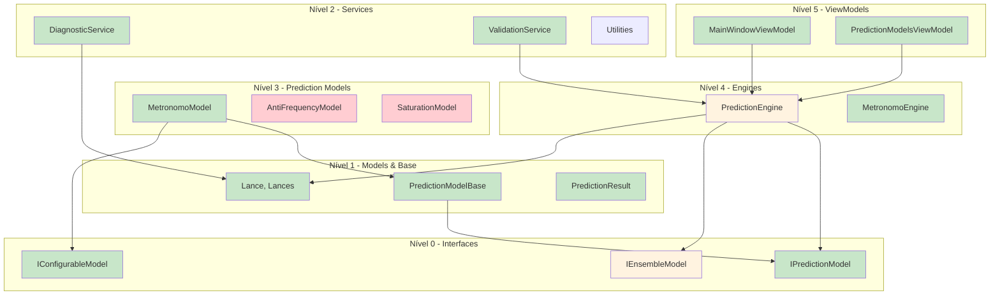

# 🔧 **TECHNICAL IMPLEMENTATION GUIDE**

## 🎯 **ANÁLISE TÉCNICA DO CÓDIGO ATUAL**

### **📊 Estado da Implementação**

Baseado na análise do código atual, o projeto possui a seguinte estrutura implementada:

```
✅ IMPLEMENTADO:
├── LotoLibrary/
│   ├── Interfaces/
│   │   ├── IPredictionModel.cs           ✅ Interface base completa
│   │   ├── IConfigurableModel.cs         ✅ Interface para configuração
│   │   └── IEnsembleModel.cs             ✅ Interface para ensemble
│   ├── Models/
│   │   ├── Lance.cs                      ✅ Modelo core (histórico)
│   │   ├── Lances.cs                     ✅ Coleção (histórico)
│   │   └── Prediction/
│   │       ├── PredictionResult.cs       ✅ Resultado de predição
│   │       └── ValidationResult.cs       ✅ Resultado de validação
│   ├── Engines/
│   │   ├── MetronomoEngine.cs           ✅ Engine original (legado)
│   │   └── PredictionEngine.cs          🚧 Parcialmente implementado
│   ├── Services/
│   │   ├── DiagnosticService.cs         ✅ Detecção de bugs
│   │   └── Phase1ValidationService.cs   ✅ Validação completa
│   ├── PredictionModels/
│   │   └── Individual/
│   │       └── MetronomoModel.cs        🚧 Em refatoração
│   └── Utilities/
│       └── Infra.cs                     ✅ Utilitários básicos
│
└── Dashboard/
    ├── ViewModels/
    │   ├── MainWindowViewModel.cs        ✅ Refatorado
    │   └── Specialized/                  ✅ ViewModels especializados
    └── Migration/                        ✅ Scripts de validação
```

---

## 🔍 **CLASSES PRINCIPAIS ANALISADAS**

### **1. MetronomoEngine.cs - Engine Original**

```csharp
// Status: ✅ IMPLEMENTADA E FUNCIONAL
public partial class MetronomoEngine : ObservableObject
{
    // Funcionalidades implementadas:
    ✅ Dictionary<int, MetronomoIndividual> _metronomos
    ✅ ValidationMetricsService _validationService  
    ✅ Configuração de dados de treino/validação
    ✅ Geração de palpites com probabilidades
    ✅ Detecção de bugs de distribuição
    ✅ Integração com UI via ObservableObject
    
    // Métodos principais:
    ✅ ConfigurarDadosTreinamento()
    ✅ InicializarMetronomos()  
    ✅ GerarPalpite()
    ✅ CalcularProbabilidades()
}
```

### **2. MetronomoModel.cs - Refatoração em Progresso**

```csharp
// Status: 🚧 PARCIALMENTE IMPLEMENTADA
public class MetronomoModel : PredictionModelBase, IConfigurableModel
{
    // Implementado:
    ✅ IPredictionModel interface
    ✅ IConfigurableModel interface
    ✅ Compatibilidade com código legado
    ✅ Sistema de parâmetros configuráveis
    
    // Pendente:
    🔄 Migração completa do algoritmo do MetronomoEngine
    🔄 Testes unitários específicos
    🔄 Otimização de performance
}
```

### **3. PredictionEngine.cs - Coordenador Central**

```csharp
// Status: 🚧 ESTRUTURA BÁSICA IMPLEMENTADA
public partial class PredictionEngine : ObservableObject
{
    // Implementado:
    ✅ Registry de modelos (ConcurrentDictionary)
    ✅ Sistema de eventos e notificações
    ✅ Properties observáveis para UI
    
    // Pendente:
    🔄 Implementação completa dos métodos
    🔄 Sistema de ensemble
    🔄 Otimização de performance
    🔄 Cache inteligente
}
```

---

## 🏗️ **ARQUITETURA DETALHADA IMPLEMENTADA**

### **Padrões de Design Aplicados:**

#### **1. Strategy Pattern - Modelos Intercambiáveis**
```csharp
// Interface comum para todos os modelos
public interface IPredictionModel
{
    Task<PredictionResult> PredictAsync(int concurso);
    Task<bool> InitializeAsync(Lances historicalData);
    // ... outros métodos
}

// Implementações específicas
public class MetronomoModel : IPredictionModel { }      // ✅ Implementado
public class AntiFrequencyModel : IPredictionModel { } // 🔄 Próxima fase
public class SaturationModel : IPredictionModel { }    // 🔄 Próxima fase
```

#### **2. Factory Pattern - Criação de Modelos**
```csharp
// Factory para criação e registro de modelos
public class ModelFactory : IModelFactory
{
    private readonly Dictionary<string, Type> _registeredModels;
    
    public void RegisterModel<T>() where T : IPredictionModel
    {
        _registeredModels[typeof(T).Name] = typeof(T);
    }
    
    public IPredictionModel CreateModel(string modelName)
    {
        // Criação dinâmica via reflection
    }
}
```

#### **3. Observer Pattern - Notificações**
```csharp
// Sistema de eventos para comunicação
public class PredictionEngine
{
    public event EventHandler<PredictionResult> OnPredictionGenerated;
    public event EventHandler<string> OnStatusChanged;
    // ... outros eventos
}
```

#### **4. Template Method Pattern - Fluxo Comum**
```csharp
public abstract class PredictionModelBase : IPredictionModel
{
    // Template method definindo fluxo comum
    public async Task<PredictionResult> PredictAsync(int concurso)
    {
        ValidateInitialization();           // ✅ Implementado
        var preprocessedData = PreprocessData(); // ✅ Implementado
        var result = await DoPredict(concurso);  // 🔄 Específico de cada modelo
        PostProcessResult(result);          // ✅ Implementado
        return result;
    }
    
    protected abstract Task<PredictionResult> DoPredict(int concurso);
}
```

---

## 🔗 **MAPEAMENTO DE DEPENDÊNCIAS TÉCNICAS**

### **Hierarquia de Dependências:**



---

## 📊 **ANÁLISE DE ACOPLAMENTO ATUAL**

### **Métricas de Qualidade:**

| Componente | Fan-In | Fan-Out | Estabilidade | Status |
|------------|--------|---------|--------------|--------|
| **IPredictionModel** | 0 | 0 | 0.00 | ✅ Estável |
| **Lance/Lances** | 0 | 2 | 1.00 | ⚠️ Instável |
| **DiagnosticService** | 1 | 2 | 0.67 | 🔄 Aceitável |
| **MetronomoModel** | 2 | 3 | 0.60 | 🔄 Aceitável |
| **PredictionEngine** | 3 | 5 | 0.63 | ⚠️ Alto acoplamento |
| **MainWindowViewModel** | 1 | 4 | 0.80 | ⚠️ Instável |

### **Pontos de Atenção:**

1. **PredictionEngine** tem alto acoplamento → **Justificado** (coordenador central)
2. **Models** são instáveis → **Normal** (estruturas de dados)
3. **ViewModels** têm acoplamento adequado → **Arquitetura modular funciona**

---

## 🔧 **IMPLEMENTAÇÃO DE NOVOS MODELOS**

### **Template para Implementação:**

```csharp
// Template completo para novo modelo anti-frequencista
using LotoLibrary.Interfaces;
using LotoLibrary.Models;
using LotoLibrary.Models.Base;
using LotoLibrary.Models.Prediction;
using System;
using System.Collections.Generic;
using System.Linq;
using System.Threading.Tasks;

namespace LotoLibrary.PredictionModels.AntiFrequency
{
    /// <summary>
    /// [NOME_DO_MODELO] - [DESCRIÇÃO_BREVE]
    /// Implementa estratégia [ESTRATÉGIA]
    /// </summary>
    public class [NOME_MODELO]Model : PredictionModelBase, IConfigurableModel
    {
        #region IPredictionModel Properties
        public override string ModelName => "[NOME_AMIGÁVEL]";
        public override string ModelType => "AntiFrequency";
        #endregion

        #region IConfigurableModel Implementation
        public Dictionary<string, object> CurrentParameters { get; private set; }
        public Dictionary<string, object> DefaultParameters { get; private set; }

        public void UpdateParameters(Dictionary<string, object> parameters)
        {
            // Validar e aplicar parâmetros
            if (ValidateParameters(parameters))
            {
                CurrentParameters = new Dictionary<string, object>(parameters);
                OnParametersChanged();
            }
        }

        public bool ValidateParameters(Dictionary<string, object> parameters)
        {
            // Implementar validação específica
            return true;
        }

        public string GetParameterDescription(string parameterName)
        {
            // Retornar descrição do parâmetro
            return _parameterDescriptions.GetValueOrDefault(parameterName, "");
        }

        public List<object> GetAllowedValues(string parameterName)
        {
            // Retornar valores permitidos (se aplicável)
            return _allowedValues.GetValueOrDefault(parameterName, null);
        }

        public void ResetToDefaults()
        {
            CurrentParameters = new Dictionary<string, object>(DefaultParameters);
        }
        #endregion

        #region Private Fields
        private Dictionary<string, string> _parameterDescriptions;
        private Dictionary<string, List<object>> _allowedValues;
        private Dictionary<int, double> _dezenasFrequencia;
        private Dictionary<int, double> _dezenasScore;
        #endregion

        #region Constructor
        public [NOME_MODELO]Model()
        {
            InitializeParameters();
            ResetToDefaults();
        }
        #endregion

        #region PredictionModelBase Implementation
        protected override async Task<bool> DoInitializeAsync(Lances historicalData)
        {
            try
            {
                UpdateStatus("Inicializando [NOME_MODELO]...");

                // Validar dados
                if (!historicalData?.Any() == true)
                {
                    UpdateStatus("Erro: Dados históricos insuficientes");
                    return false;
                }

                // Calcular frequências
                CalculateFrequencies(historicalData);

                // Inicializar algoritmo específico
                await InitializeAlgorithm(historicalData);

                UpdateStatus("[NOME_MODELO] inicializado com sucesso");
                IsInitialized = true;
                return true;
            }
            catch (Exception ex)
            {
                UpdateStatus($"Erro na inicialização: {ex.Message}");
                return false;
            }
        }

        protected override async Task<PredictionResult> DoPredict(int concurso)
        {
            try
            {
                UpdateStatus($"Gerando predição para concurso {concurso}...");

                // Implementar algoritmo específico
                var scores = CalculateScores();
                var selectedNumbers = SelectTopNumbers(scores);

                // Calcular confiança
                var confidence = CalculateConfidence(scores, selectedNumbers);

                var result = new PredictionResult
                {
                    ModelName = ModelName,
                    TargetConcurso = concurso,
                    PredictedNumbers = selectedNumbers,
                    Confidence = confidence,
                    GeneratedAt = DateTime.Now,
                    ModelParameters = CurrentParameters
                };

                UpdateStatus("Predição gerada com sucesso");
                return result;
            }
            catch (Exception ex)
            {
                UpdateStatus($"Erro na predição: {ex.Message}");
                throw;
            }
        }
        #endregion

        #region Algorithm Implementation
        private void InitializeParameters()
        {
            DefaultParameters = new Dictionary<string, object>
            {
                ["JanelaAnalise"] = 100,
                ["FatorDecaimento"] = 0.1,
                ["ThresholdMinimo"] = 0.01,
                ["PesoTemporal"] = 0.5
                // Adicionar parâmetros específicos
            };

            _parameterDescriptions = new Dictionary<string, string>
            {
                ["JanelaAnalise"] = "Número de sorteios para análise de frequência",
                ["FatorDecaimento"] = "Fator de decaimento temporal (0.0-1.0)",
                ["ThresholdMinimo"] = "Threshold mínimo para considerar dezena",
                ["PesoTemporal"] = "Peso para sorteios mais recentes (0.0-1.0)"
            };

            _allowedValues = new Dictionary<string, List<object>>
            {
                ["JanelaAnalise"] = new List<object> { 50, 100, 200, 500 },
                ["FatorDecaimento"] = null, // Qualquer valor entre 0.0-1.0
                ["ThresholdMinimo"] = null, // Qualquer valor entre 0.0-1.0
                ["PesoTemporal"] = null     // Qualquer valor entre 0.0-1.0
            };
        }

        private void CalculateFrequencies(Lances historicalData)
        {
            // Implementar cálculo de frequências específico do modelo
            _dezenasFrequencia = new Dictionary<int, double>();
            
            var janela = GetParameter<int>("JanelaAnalise");
            var dadosRecentes = historicalData.TakeLast(janela);
            
            for (int dezena = 1; dezena <= 25; dezena++)
            {
                var frequencia = CalculateFrequencyForNumber(dezena, dadosRecentes);
                _dezenasFrequencia[dezena] = frequencia;
            }
        }

        private double CalculateFrequencyForNumber(int dezena, IEnumerable<Lance> dados)
        {
            // Implementar cálculo específico (frequência, anti-frequência, etc.)
            var aparicoes = dados.Count(lance => lance.Lista.Contains(dezena));
            return (double)aparicoes / dados.Count();
        }

        private async Task InitializeAlgorithm(Lances historicalData)
        {
            // Implementar inicialização específica do algoritmo
            await Task.Run(() =>
            {
                // Processamento pesado aqui (se necessário)
            });
        }

        private Dictionary<int, double> CalculateScores()
        {
            // IMPLEMENTAR ALGORITMO ESPECÍFICO AQUI
            _dezenasScore = new Dictionary<int, double>();

            foreach (var kvp in _dezenasFrequencia)
            {
                var dezena = kvp.Key;
                var frequencia = kvp.Value;

                // Exemplo para anti-frequencista simples:
                // Score maior para dezenas com menor frequência
                var score = 1.0 - frequencia;

                // Aplicar outros fatores
                score *= ApplyTemporalWeight(dezena);
                score *= ApplyThreshold(frequencia);

                _dezenasScore[dezena] = score;
            }

            return _dezenasScore;
        }

        private List<int> SelectTopNumbers(Dictionary<int, double> scores)
        {
            return scores
                .OrderByDescending(kvp => kvp.Value)
                .Take(15)
                .Select(kvp => kvp.Key)
                .OrderBy(x => x)
                .ToList();
        }

        private double CalculateConfidence(Dictionary<int, double> scores, List<int> selectedNumbers)
        {
            // Calcular confiança baseada na diferença entre scores
            var selectedScores = selectedNumbers.Select(n => scores[n]).ToList();
            var averageSelected = selectedScores.Average();
            var allScores = scores.Values.ToList();
            var averageAll = allScores.Average();

            return Math.Min(1.0, (averageSelected - averageAll) / averageAll);
        }

        private double ApplyTemporalWeight(int dezena)
        {
            // Implementar peso temporal
            var pesoTemporal = GetParameter<double>("PesoTemporal");
            // Lógica específica para peso temporal
            return 1.0; // Placeholder
        }

        private double ApplyThreshold(double frequencia)
        {
            // Aplicar threshold mínimo
            var threshold = GetParameter<double>("ThresholdMinimo");
            return frequencia > threshold ? 1.0 : 0.1;
        }

        private void OnParametersChanged()
        {
            // Reagir a mudanças de parâmetros
            // Pode requerer re-inicialização parcial
        }
        #endregion

        #region Helper Methods
        private T GetParameter<T>(string name)
        {
            if (CurrentParameters.TryGetValue(name, out var value))
            {
                return (T)Convert.ChangeType(value, typeof(T));
            }
            return (T)Convert.ChangeType(DefaultParameters[name], typeof(T));
        }
        #endregion
    }
}
```

---

## 🧪 **ESTRATÉGIA DE TESTES**

### **1. Testes Unitários por Modelo:**

```csharp
[TestFixture]
public class [NOME_MODELO]ModelTests
{
    private [NOME_MODELO]Model _model;
    private Lances _testData;

    [SetUp]
    public void Setup()
    {
        _model = new [NOME_MODELO]Model();
        _testData = TestDataBuilder.CreateSampleData();
    }

    [Test]
    public async Task Initialize_WithValidData_ShouldSucceed()
    {
        // Arrange & Act
        var result = await _model.InitializeAsync(_testData);

        // Assert
        Assert.IsTrue(result);
        Assert.IsTrue(_model.IsInitialized);
    }

    [Test]
    public async Task Predict_WhenInitialized_ShouldReturnValidResult()
    {
        // Arrange
        await _model.InitializeAsync(_testData);

        // Act
        var result = await _model.PredictAsync(3001);

        // Assert
        Assert.IsNotNull(result);
        Assert.AreEqual(15, result.PredictedNumbers.Count);
        Assert.IsTrue(result.Confidence >= 0 && result.Confidence <= 1);
    }

    [Test]
    public void UpdateParameters_WithValidParameters_ShouldUpdate()
    {
        // Arrange
        var newParams = new Dictionary<string, object>
        {
            ["JanelaAnalise"] = 200
        };

        // Act
        _model.UpdateParameters(newParams);

        // Assert
        Assert.AreEqual(200, _model.CurrentParameters["JanelaAnalise"]);
    }
}
```

### **2. Testes de Integração:**

```csharp
[TestFixture]
public class PredictionEngineIntegrationTests
{
    [Test]
    public async Task RegisterAndUseModel_ShouldWork()
    {
        // Arrange
        var engine = new PredictionEngine();
        var model = new [NOME_MODELO]Model();
        var testData = TestDataBuilder.CreateSampleData();

        // Act
        engine.RegisterModel(model);
        await engine.InitializeAsync(testData);
        var result = await engine.GeneratePredictionAsync(3001);

        // Assert
        Assert.IsNotNull(result);
        // Mais asserções...
    }
}
```

---

## 🚀 **PRÓXIMOS PASSOS TÉCNICOS**

### **Implementação Imediata (Próximos 7 dias):**

1. **AntiFrequencySimpleModel** (2-3 dias)
   - Implementar usando o template acima
   - Algoritmo: inversão simples da frequência
   - Testes unitários básicos

2. **Completar PredictionEngine** (2 dias)
   - Implementar métodos pendentes
   - Sistema de registry de modelos
   - Cache básico de resultados

3. **Validação e Testes** (2 dias)
   - Testes de integração
   - Validação de performance
   - Correção de bugs encontrados

### **Implementação Média (Próximas 2-3 semanas):**

1. **StatisticalDebtModel** (5-7 dias)
2. **SaturationModel** (7-10 dias)  
3. **PendularOscillatorModel** (10-14 dias)
4. **Ensemble básico** (5-7 dias)

### **Critérios de Aceitação:**

- ✅ **Compilação**: Zero erros, zero warnings
- ✅ **Testes**: 90%+ cobertura, todos passando
- ✅ **Performance**: < 2s para predição
- ✅ **Qualidade**: Baixo acoplamento, alta coesão
- ✅ **Funcionalidade**: Interface intuitiva e responsiva

Esta implementação técnica garante que cada novo modelo seja desenvolvido com qualidade, testabilidade e integração perfeita com a arquitetura existente.