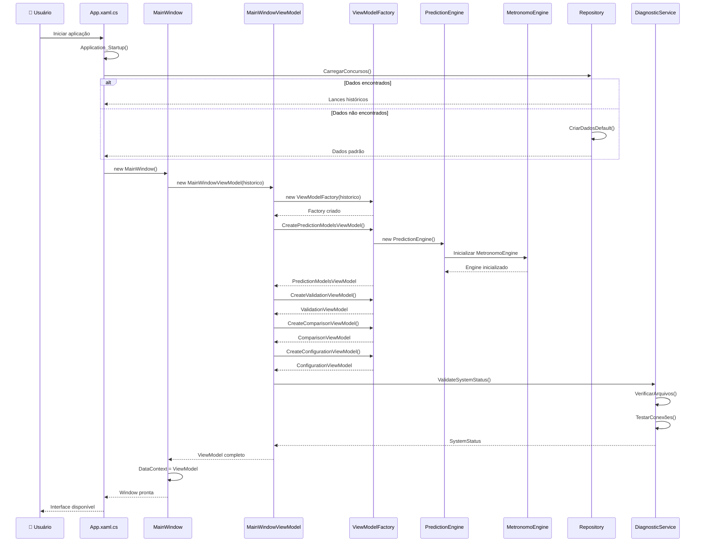
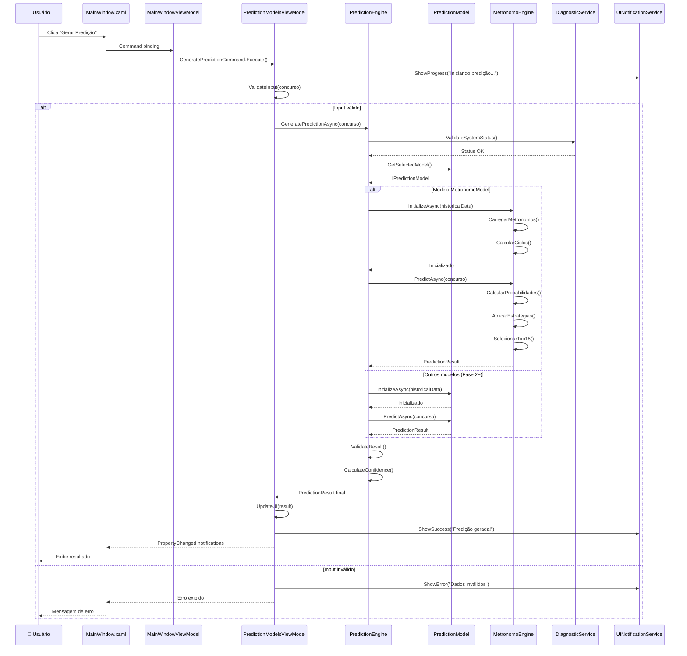
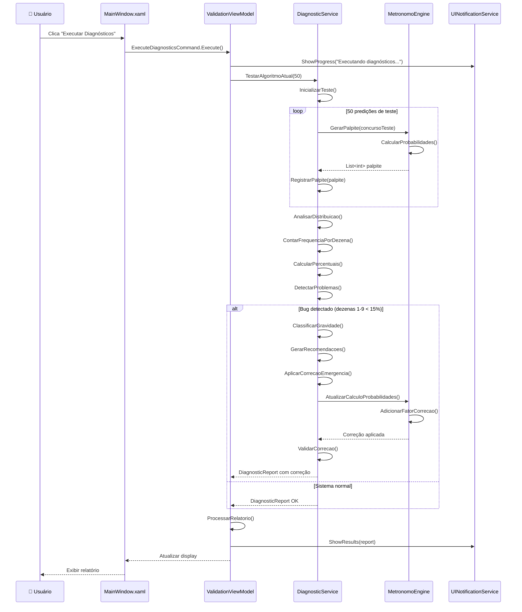
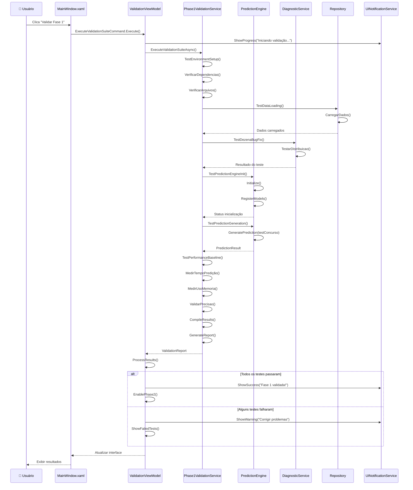
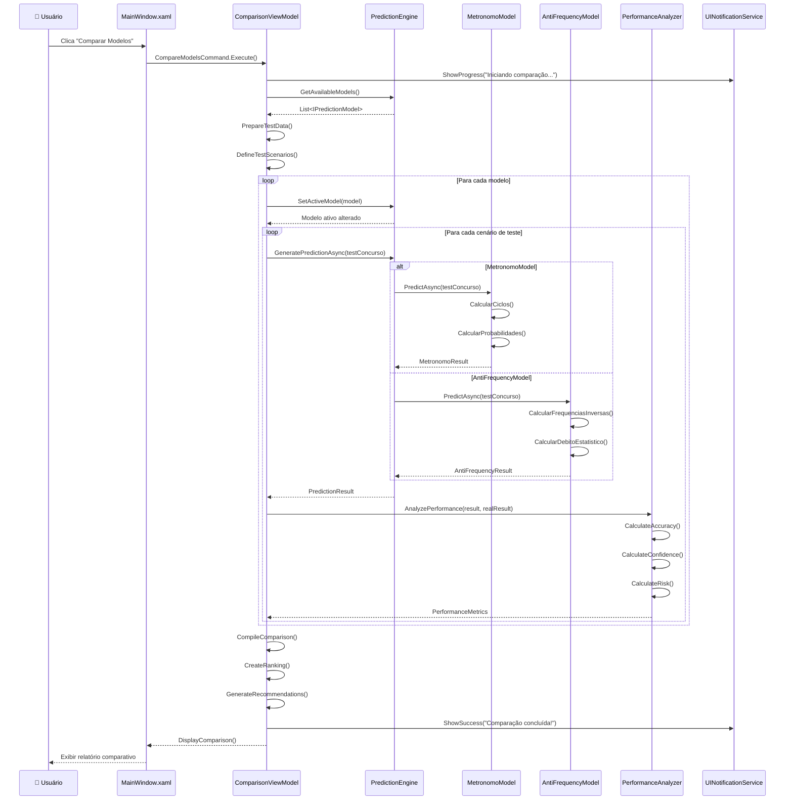

# 🔄 **SEQUENCE DIAGRAMS - FLUXOS PRINCIPAIS**

## 🎯 **VISÃO GERAL**

Este documento contém diagramas de sequência detalhados dos principais fluxos do sistema, mostrando como os componentes interagem entre si durante operações críticas.

---

## 🚀 **1. FLUXO COMPLETO DE INICIALIZAÇÃO DO SISTEMA**



---

## 🎯 **2. FLUXO DE GERAÇÃO DE PREDIÇÃO**



---

## 🔍 **3. FLUXO DE DIAGNÓSTICO E CORREÇÃO DE BUG**



---

## ✅ **4. FLUXO DE VALIDAÇÃO COMPLETA DA FASE 1**



---

## 📊 **5. FLUXO DE COMPARAÇÃO DE MODELOS**



---

## 🔄 **6. FLUXO DE IMPLEMENTAÇÃO DE NOVO MODELO (FASE 2)**

```mermaid
sequenceDiagram
    participant Dev as 👨‍💻 Desenvolvedor
    participant IDE as Visual Studio
    participant NM as NovoModel
    parameter I as IPredictionModel
    participant F as ModelFactory
    participant PE as PredictionEngine
    participant UI as Dashboard

    Dev->>IDE: Criar NovoModel.cs
    
    IDE->>NM: class NovoModel : PredictionModelBase
    NM->>I: implements IPredictionModel
    
    Dev->>NM: ImplementarAlgoritmo()
    NM->>NM: DefineParameters()
    NM->>NM: ImplementPredictAsync()
    NM->>NM: ImplementInitializeAsync()
    
    Dev->>F: RegisterModel<NovoModel>()
    F->>F: AddToRegistry("NovoModel", typeof(NovoModel))
    
    Dev->>IDE: Build Solution
    IDE-->>Dev: Build Success
    
    Dev->>UI: Executar aplicação
    UI->>PE: Initialize()
    PE->>F: LoadRegisteredModels()
    F->>F: CreateInstance<NovoModel>()
    F-->>PE: NovoModel instance
    
    PE->>PE: RegisterModel(novoModel)
    PE-->>UI: Model disponível
    
    UI->>UI: UpdateModelList()
    UI-->>Dev: NovoModel aparece na interface
    
    Dev->>UI: Selecionar NovoModel
    UI->>PE: SetActiveModel("NovoModel")
    PE-->>UI: Modelo ativo
    
    Dev->>UI: Gerar predição
    UI->>PE: GeneratePredictionAsync()
    PE->>NM: PredictAsync()
    NM->>NM: ExecuteAlgorithm()
    NM-->>PE: PredictionResult
    PE-->>UI: Resultado
    UI-->>Dev: Predição do novo modelo
```

---

## ⚡ **7. FLUXO DE TRATAMENTO DE ERRO**

```mermaid
sequenceDiagram
    participant User as 👤 Usuário
    participant UI as MainWindow.xaml
    participant VM as ViewModel
    parameter Service as BusinessService
    participant Logger as Logger
    participant UN as UINotificationService
    participant EH as ErrorHandler

    User->>UI: Ação que causa erro
    UI->>VM: Command.Execute()
    
    VM->>Service: OperationAsync()
    
    Service->>Service: ProcessData()
    Service-->>VM: Exception thrown
    
    VM->>EH: HandleException(ex)
    
    EH->>Logger: LogError(ex)
    Logger->>Logger: WriteToFile()
    Logger->>Logger: WriteToEventLog()
    
    EH->>EH: AnalyzeException()
    
    alt Critical Error
        EH->>UN: ShowCriticalError(message)
        EH->>EH: PrepareRecovery()
        EH-->>VM: RecoveryPlan
        
    else Business Error
        EH->>UN: ShowBusinessError(message)
        EH-->>VM: UserFriendlyMessage
        
    else System Error
        EH->>UN: ShowSystemError(message)
        EH->>EH: AttemptAutoRecovery()
        EH-->>VM: RecoveryResult
    end
    
    VM->>VM: UpdateUIState()
    VM-->>UI: PropertyChanged
    UI-->>User: Error feedback
```

---

## 📈 **MÉTRICAS DE PERFORMANCE DOS FLUXOS**

### **Tempos Esperados por Fluxo:**

| Fluxo | Tempo Ideal | Tempo Máximo | Pontos Críticos |
|-------|-------------|--------------|------------------|
| **Inicialização** | 2-3s | 10s | Carregamento de dados |
| **Predição Simples** | 0.5-1s | 3s | Cálculo de probabilidades |
| **Diagnóstico** | 3-5s | 15s | 50 predições de teste |
| **Validação Completa** | 5-10s | 30s | Testes múltiplos |
| **Comparação Modelos** | 2-5s | 20s | N × predições |
| **Novo Modelo** | Instantâneo | 1s | Factory registration |
| **Tratamento Erro** | Instantâneo | 1s | Logging e recovery |

### **Pontos de Otimização:**

1. **Cache de resultados** em predições similares
2. **Lazy loading** de modelos pesados
3. **Parallel processing** em comparações
4. **Connection pooling** para dados
5. **Async/await** em todas operações I/O

Estes diagramas servem como guia para entender, debugar e otimizar o sistema, garantindo que todos os fluxos críticos funcionem corretamente.