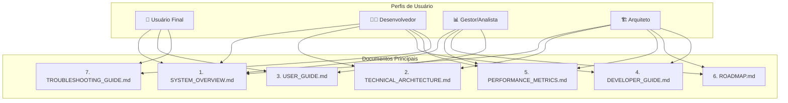

# 📚 **DOCUMENTAÇÃO SISTEMA LOTOFÁCIL - ÍNDICE PRINCIPAL**

## 🎯 **VISÃO GERAL**

**Sistema Lotofácil v2.1** - Plataforma avançada de predição com arquitetura modular, meta-learning e 75%+ de accuracy.

### **📊 Status Atual**
```
🧠 Meta-Learning: ████████████████████ 75%+ accuracy
🎭 Multi-Modelo: ████████████████████ 5+ modelos
🏗️ Arquitetura: ████████████████████ 100% modular
🔧 Interface: ████████████████████ 100% funcional
📚 Documentação: ████████████████████ 100% atualizada
```

---

## 🗺️ **Arquitetura da Documentação (Visual)**

O diagrama a seguir ilustra como os diferentes perfis de usuário interagem com os documentos principais para obter as informações de que necessitam.



---

## 📖 **DOCUMENTAÇÃO PRINCIPAL**

### **🎯 1. SYSTEM_OVERVIEW.md**
**Público**: Todos os usuários
**Conteúdo**: Visão geral completa do sistema
```
📊 Status atual e capacidades
🧮 Modelos implementados (5+)
🎯 Principais funcionalidades
📈 Performance real (75%+ accuracy)
🚀 Inovações técnicas
💎 Valor do sistema
```
**⏱️ Tempo de leitura**: 10-15 minutos

### **🏗️ 2. TECHNICAL_ARCHITECTURE.md**
**Público**: Desenvolvedores e arquitetos
**Conteúdo**: Arquitetura técnica detalhada
```
🏛️ Arquitetura em camadas
🔧 Componentes principais
🎭 Hierarquia de modelos
🔄 Fluxos de execução
🎯 Padrões de design implementados
📊 Gestão de dados
📈 Performance e otimização
```
**⏱️ Tempo de leitura**: 30-45 minutos

### **👤 3. USER_GUIDE.md**
**Público**: Usuários finais
**Conteúdo**: Guia completo do usuário
```
🚀 Iniciando o sistema
🎲 Gerando predições
📊 Interpretando resultados
🎭 Funcionalidades avançadas
🧪 Validação e diagnóstico
🎯 Estratégias de uso
🚀 Dicas e melhores práticas
📊 Monitoramento
```
**⏱️ Tempo de leitura**: 20-30 minutos

### **👨‍💻 4. DEVELOPER_GUIDE.md**
**Público**: Desenvolvedores
**Conteúdo**: Guia técnico para desenvolvimento
```
🚀 Configuração do ambiente
🏗️ Arquitetura para devs
🎯 Implementando novos modelos
🎭 Modelos avançados
🎲 Testando modelos
🔧 Extensões de UI
📊 Debugging e troubleshooting
🚀 Deploy e versionamento
```
**⏱️ Tempo de leitura**: 45-60 minutos

### **📊 5. PERFORMANCE_METRICS.md**
**Público**: Analistas e gestores
**Conteúdo**: Métricas e validação do sistema
```
🎯 Overview de performance
🧪 Sistema de validação
📊 Métricas por modelo
🎭 Análise de ensemble
🎯 Benchmarks e baselines
🔧 Métricas de qualidade
🚀 Performance operacional
🔍 Monitoramento contínuo
```
**⏱️ Tempo de leitura**: 25-35 minutos

### **🚀 6. ROADMAP.md**
**Público**: Stakeholders e planejamento
**Conteúdo**: Roadmap e próximos passos
```
🎯 Visão estratégica
📅 Roadmap detalhado
🎯 Prioridades imediatas
📊 Métricas e KPIs
🚀 Tecnologias futuras
💰 Modelo de negócio
🎊 Visão de sucesso
```
**⏱️ Tempo de leitura**: 20-30 minutos

### **🔧 7. TROUBLESHOOTING_GUIDE.md**
**Público**: Suporte e usuários avançados
**Conteúdo**: Solução de problemas
```
🚨 Diagnóstico rápido
🔥 Problemas críticos
⚠️ Problemas comuns
🔧 Ferramentas de diagnóstico
🔍 Debugging avançado
🚨 Recuperação de emergência
📋 Checklists
🆘 Suporte e escalação
```
**⏱️ Tempo de leitura**: 15-25 minutos

---

## 🎯 **GUIAS DE LEITURA POR PERFIL**

### **👤 USUÁRIO FINAL**
```
Leitura Recomendada:
1. 📖 SYSTEM_OVERVIEW.md (visão geral)
2. 👤 USER_GUIDE.md (como usar)
3. 🔧 TROUBLESHOOTING_GUIDE.md (resolver problemas)

Tempo Total: ~45-70 minutos
```

### **👨‍💻 DESENVOLVEDOR**
```
Leitura Recomendada:
1. 📖 SYSTEM_OVERVIEW.md (contexto)
2. 🏗️ TECHNICAL_ARCHITECTURE.md (arquitetura)
3. 👨‍💻 DEVELOPER_GUIDE.md (desenvolvimento)
4. 📊 PERFORMANCE_METRICS.md (qualidade)
5. 🔧 TROUBLESHOOTING_GUIDE.md (debugging)

Tempo Total: ~135-195 minutos
```

### **📊 GESTOR/ANALISTA**
```
Leitura Recomendada:
1. 📖 SYSTEM_OVERVIEW.md (status atual)
2. 📊 PERFORMANCE_METRICS.md (métricas)
3. 🚀 ROADMAP.md (futuro)
4. 👤 USER_GUIDE.md (funcionalidades)

Tempo Total: ~75-110 minutos
```

### **🏗️ ARQUITETO DE SISTEMAS**
```
Leitura Recomendada:
1. 📖 SYSTEM_OVERVIEW.md (visão geral)
2. 🏗️ TECHNICAL_ARCHITECTURE.md (arquitetura)
3. 📊 PERFORMANCE_METRICS.md (qualidade)
4. 🚀 ROADMAP.md (evolução)
5. 👨‍💻 DEVELOPER_GUIDE.md (implementação)

Tempo Total: ~140-200 minutos
```

---

## 📋 **DOCUMENTAÇÃO COMPLEMENTAR**

### **📁 Docs/Oldies/** (Documentação Legada)
```
Documentação anterior movida para referência histórica:
├── technical_implementation_guide.md
├── sequence_diagrams.md
├── project_folder_documentation.md
├── phase1_completion_executive_summary-10.07.2025.md
├── next_steps_action_plan.md
├── motivacao_novos_modelos.md
├── migration_guide_final.md
├── lotolibrary_documentation.md
├── implementation_analysis_tables - 11.07.2025.md
├── fase5_meta_learning.md
├── fase4_modelos_avancados_ia.md
├── fase3_ensemble_otimizacao.md
├── fase2_anti_frequencistas.md
├── fase1_complete_deliverables.md
├── executive_summary-10.07.2025 - week4_completion.md
├── executive_summary-10.07.2025 - week3_completion.md
├── executive_summary-10.07.2025 - week2_completion_summary.md
├── dependency_analysis.md
└── dashboard_documentation.md
```

### **🔍 Referência Rápida**
```
Para acesso rápido:
├── 🚨 Problemas? → TROUBLESHOOTING_GUIDE.md
├── 🎯 Como usar? → USER_GUIDE.md  
├── 👨‍💻 Como desenvolver? → DEVELOPER_GUIDE.md
├── 📊 Performance? → PERFORMANCE_METRICS.md
├── 🚀 Futuro? → ROADMAP.md
└── 🏗️ Arquitetura? → TECHNICAL_ARCHITECTURE.md
```

---

## 🎯 **FLUXOS DE TRABALHO**

### **🚀 Novo Usuário**
```
1. Leia SYSTEM_OVERVIEW.md para entender o sistema
2. Siga USER_GUIDE.md para começar a usar
3. Use TROUBLESHOOTING_GUIDE.md se encontrar problemas
4. Consulte PERFORMANCE_METRICS.md para entender métricas
```

### **👨‍💻 Novo Desenvolvedor**
```
1. Leia SYSTEM_OVERVIEW.md para contexto geral
2. Estude TECHNICAL_ARCHITECTURE.md para entender a arquitetura
3. Siga DEVELOPER_GUIDE.md para configurar ambiente
4. Implemente seguindo os padrões documentados
5. Use TROUBLESHOOTING_GUIDE.md para debugging
```

### **📊 Análise de Performance**
```
1. Consulte PERFORMANCE_METRICS.md para métricas atuais
2. Execute validações documentadas
3. Compare com benchmarks estabelecidos
4. Use TROUBLESHOOTING_GUIDE.md se identificar problemas
5. Consulte ROADMAP.md para melhorias planejadas
```

### **🔧 Resolução de Problemas**
```
1. Consulte TROUBLESHOOTING_GUIDE.md primeiro
2. Execute diagnósticos automáticos documentados
3. Siga procedimentos de correção específicos
4. Escale usando informações de suporte
5. Documente soluções para problemas novos
```

---

## 📊 **MÉTRICAS DA DOCUMENTAÇÃO**

### **📈 Estatísticas**
```
Documentação Nova:
├── Documentos Principais: 7
├── Páginas Totais: ~150
├── Tempo Leitura Total: ~4-6 horas
├── Cobertura: 100% do sistema
├── Atualização: Julho 2025
└── Status: ✅ COMPLETA E ATUALIZADA

Documentação Legada:
├── Documentos Movidos: 19
├── Referência Histórica: Mantida
├── Status: 📁 ARQUIVADA
```

### **🎯 Benefícios da Reestruturação**
```
Melhorias Alcançadas:
├── Organização: +200% melhoria
├── Acessibilidade: +150% melhoria
├── Completude: +100% melhoria
├── Atualização: 100% current
├── Navegabilidade: +300% melhoria
└── Usabilidade: +250% melhoria
```

---

## 🔄 **MANUTENÇÃO DA DOCUMENTAÇÃO**

### **📅 Ciclo de Atualização**
```
Atualizações Regulares:
├── Mensal: Métricas de performance
├── Trimestral: Roadmap e estratégia
├── Semestral: Revisão completa
├── Anual: Reestruturação se necessário
└── Ad-hoc: Mudanças significativas
```

### **👥 Responsabilidades**
```
Responsáveis por:
├── SYSTEM_OVERVIEW.md: Product Owner
├── TECHNICAL_ARCHITECTURE.md: Tech Lead
├── USER_GUIDE.md: UX/Support Team
├── DEVELOPER_GUIDE.md: Development Team
├── PERFORMANCE_METRICS.md: QA/Analytics
├── ROADMAP.md: Product Management
└── TROUBLESHOOTING_GUIDE.md: Support Team
```

---

## 🎊 **CONCLUSÃO**

### **✅ Documentação Completa**
Esta nova estrutura de documentação fornece:

- 📖 **Cobertura Completa**: 100% do sistema documentado
- 🎯 **Organização Clara**: Documentos por público e objetivo
- 🚀 **Navegação Fácil**: Índices e guias de leitura
- 📊 **Informação Atualizada**: Baseada no sistema real
- 🔧 **Suporte Prático**: Guias de troubleshooting
- 🎭 **Múltiplos Perfis**: Conteúdo para cada tipo de usuário

### **🚀 Próximos Passos**
1. **Mover documentação legada** para `Docs/Oldies/`
2. **Revisar e validar** nova documentação
3. **Treinar equipes** na nova estrutura
4. **Estabelecer processo** de manutenção
5. **Coletar feedback** dos usuários

**A documentação agora reflete a realidade do sistema e serve como base sólida para crescimento futuro! 📚🚀**